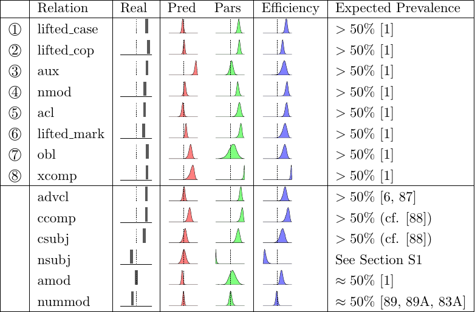
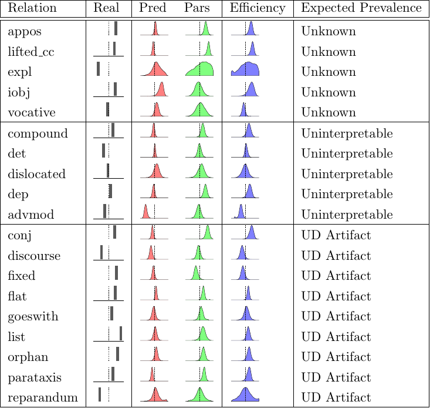
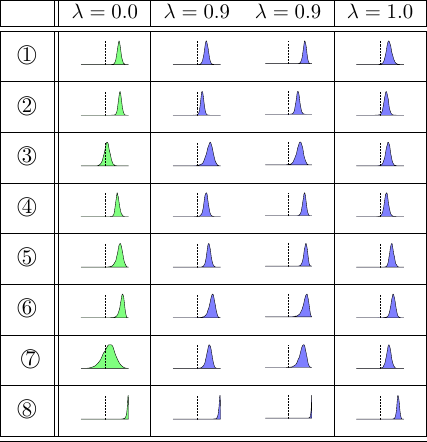
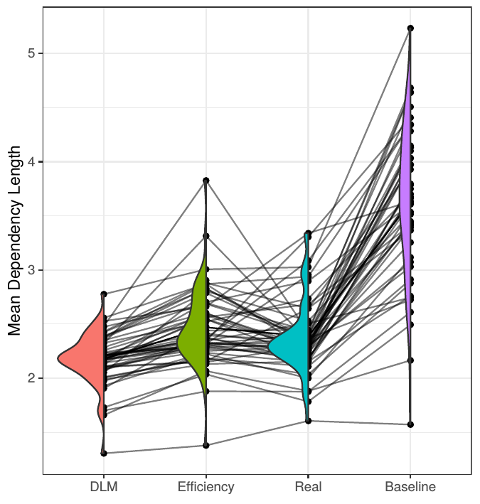
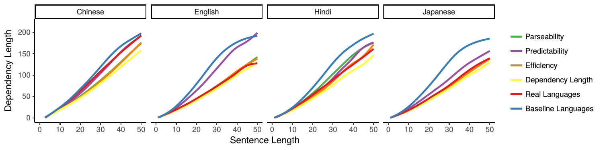
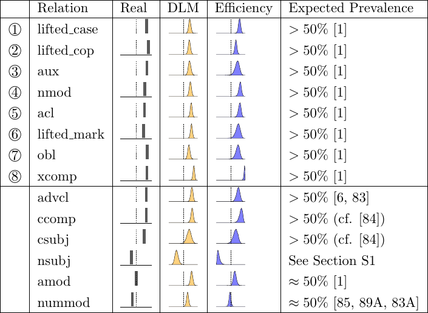

Formalization of Greenberg Correlation Universals
=================================================

Here we describe how we selected the word order correlations in Table 1 of the main paper, and how we formalized these using syntactic relations defined by Universal Dependencies.

We base our formalization on the comprehensive study by Dryer (Dryer 1992).[1] Greenberg’s original study was based on 30 languages; more recently, Dryer (Dryer 1992) documented the word order correlations based on typological data from 625 languages. Dryer (1992) formulated these universals as correlations between the order of objects and verbs and the orders of other syntactic relations. We test our ordering grammars for these correlations by testing whether the coefficients for these syntactic relations have the same sign as the coefficient of the verb-object relation. Testing correlations is therefore constrained by the degree to which these relations are annotated in UD. The verb–object relation corresponds to the *obj* relation defined by UD. While most of the other relations also correspond to UD relations, some are not annotated reliably. We were able formalize eleven out of Dryer’s sixteen correlations in UD. Six of these could not be expressed individually in UD, and were collapsed into three coarse-grained correlations: First, tense/aspect and negative auxiliaries are together represented by the *aux* relation in UD. Second, the relation between complementizers and adverbial subordinators with their complement clauses is represented by the *mark* relation. Third, both the verb-PP relation and the relation between adjectives and their standard of comparison is captured by the *obl* relation.

The resulting operationalization is shown in Table \[table:greenberg-dryer\]. For each relation, we show the direction of the UD syntactic relation: → indicates that the verb patterner is the head; ← indicates that the object patterner is the head.

As described in *Materials and Methods*, we follow Futrell, Mahowald, and Gibson (2015a) in converting the Universal Dependencies format to a format closer to standard syntactic theory, promoting adpositions, copulas, and complementizers to heads. As a consequence, the direction of the relations *case*, *cop*, and *mark* is reversed compared to Universal Dependencies. For clarity, we refer to these reversed relations as *lifted\_case*, *lifted\_cop*, and *lifted\_mark*.

#### Excluded Correlations

Here, we discuss in more detail the five correlations from Dryer’s study that we had to exclude. First, we excluded three correlations that are not annotated reliably in UD, and are only relevant to some of the world’s languages: Question particles, plural words (i.e., independent plural markers), and articles. All three types of elements occur at most in parts of the 51 UD languages, and none of them is annotated reliably in those languages where they occur. Among these three types of elements, the one most prominent in our sample of 51 languages is articles, which occur in many European languages. However, UD subsumes them under the *det* relation, which is also used for other highly frequent elements, such as demonstratives and quantifiers. The other elements (question particles and plural words) are found at most in a handful of UD languages, and are not specifically annotated in these either.

We also excluded the verb-manner adverb correlation. UD does not distinguish manner adverbs from other elements labeled as adverbs, such as sentence-level adverbs and negation markers, whose ordering is very different from manner adverbs. All types of adverbs are unified under the *advmod* relation. In the real orderings in our sample of 51 UD languages, the dominant ordering of *advmod* almost always matches that of subjects – that is, *advmod* dependents are predominantly ordered after the verb only in VSO languages. This observed ordering behavior in the 51 languages is very different from that documented for manner adverbs by Dryer, showing that a large part of *advmod* dependencies as annotated in UD consists of elements that are not manner adverbs.

We further excluded the verb-subject correlation, which is not satisfied by much more than half of the world’s languages (51 % among those with annotation in the *World Atlas of Language Structures* (Dryer 2013), with clear violation in 35.4 %). It is satisfied only in 33% of our sample of 51 UD languages, as quantified using the grammars we extracted. Dryer (Dryer 1992) counts this as a correlation since he describes the distribution of subject order as an interaction between a weak correlation with object order, and a very strong dominance principle favoring SV orderings. We focus on the modeling of correlations, and leave dominance principles to future research. We therefore excluded this correlation here.

#### Other Greenberg Universals

Greenberg (Greenberg 1963) stated a total of 45 universals. Twenty of these concern the structure of individual words (as opposed to word order, which we focus on here), and many of those have been argued to be explained by the “dual pressures” idea (Haspelmath 2006). The other 25 universals concern word order; Dryer (Dryer 1992) reformulated most of these as correlations with verb-object order; these form the basis of our formalization in Table \[table:greenberg-dryer\]. There are a few other well-supported word order universals that are not correlations with verb-object order. This includes dominance principles (Greenberg 1963; Croft 2003) such as the strong preference for subjects to precede objects. Furthermore, there has been interest in Greenberg’s universals 18 and 20, which describe correlations not with verb-object order, but of different elements of noun phrases (Cinque 2005; Culbertson and Adger 2014; Dryer 2018). Future work should examine whether these universals can also be linked to efficiency optimization.

#### Evaluating Accuracy of Formalization

An anonymous reviewer notes that the mapping between Dryer’s relations and UD is not perfect, since some of the UD relations subsume other relations. Here we provide evidence that this is not impact our conclusions, since the ordering of the various relations subsumed under the UD label strongly agree typologically.

1.  Correlation captures correlations with inflected tense, aspect, and negation auxiliaries as stated by Dryer (1992); however, *aux* aso encompasses other types of auxiliaires, such as modals. We note that other authors, including Greenberg (1963), have stated the correlation for all inflected auxiliaries; for further references, we refer to Plank and Filimonova (2000 Number 501).

    We used the UD treebanks to confirm that different auxiliaries tend to pattern together, and that the most frequent order of the *aux* relation coincides with that of inflected tense-aspect or negation auxiliaries.

    We collected, for each UD language, all dependents of the *aux* dependency, occurring at least 10 times, and compared their dominant orders, which we operationalized as their more common order in the treebank (auxiliary–head or head–auxiliary). The dependency occurs in all but two very small treebanks (Telugu and Irish). In 43 languages, all extracted auxiliaries had the same dominant order, with the possible exception of uninflected particles labeled *aux* (Croatian, German, Polish, Ukrainian). In three languages (Ancient Greek, Russian), there were other auxiliaries with different dominant order, but these were modal or passive auxiliaries. Finally, in three languages (Afrikaans, Old Church Slavonic, and Persian), not all tense-aspect auxiliaries showed the same dominant order as the *aux* dependency overall. For instance, in Persian, the perfect auxiliary *budan* follows the main verb, whereas the future auxiliary *xaastan xaah-* precedes it (Mace 2015, 117, 121).

    Taken together, this shows that the dominant order of the *aux* relation strongly coincides with that of inflected tense-aspect auxiliaries, except for a small number of languages where different tense-aspect auxiliaries show different orders.

2.  Correlation is formalized using *nmod* which covers not only genitives, but also all other noun-modifying NPs and PPs. The evaluation of extracted grammars against WALS (Table \[tab:grammars-wals\]) shows that, among the 37 languages where WALS has an entry, the dominant direction of *nmod* agrees with that of genitives, with two exceptions (Danish and Swedish[2].

3.  Correlation is formalized using *acl*, which covers not just relative clauses, but also other adnominal clauses. In the WALS evaluation (Table \[tab:grammars-wals\]), the dominant order of *acl* agrees with the WALS entry for relative clauses in all but three languages (Estonian, Finnish, Tamil) out of the 36 languages for which WALS has an entry. Also, UD provides a specific *acl:relcl* sub-label for relative clauses in 21 of the languages. In all but three languages, the dominant order is the same for the general *acl* label as for the specific *acl:relcl* one (exceptions: Estonian, Finnish, Hindi).

    The exceptions mainly arise because some languages have multiple common word orders for relativization: Hindi uses correlatives that can precede or follow the coreferent noun (Montaut 2004, 3.1.3) and relatives following the noun (Montaut 2004, 4.3). Estonian and Finnish have finite relative clauses following nouns ((Karlsson 2013, 176), (Tauli 1983, 256)) and nonfinite participial modifiers preceding it (Karlsson 2013 Chapter 18).

    Finally, in Tamil, the divergence is caused by the treebank annotation convention for Tamil, where the label *acl* is used to mark certain elements of compounds, not for the participial phrases that correspond most closely to relative clauses of other languages.[3]

4.  Correlation is formalized using *obl*, which covers not only PPs and standards of comparison, but also adjunct NPs. In the WALS evaluation (Table \[tab:grammars-wals\]), the dominant order of *obl* agrees with that annotated for obliques in all 18 languages for which WALS has an entry.

5.  Correlation is formalized using *xcomp*, which covers other control verbs, not just verbs of volition (‘want’).

    We used the UD treebanks to investigate whether there are differences in the ordering of ‘want’ and other verbs using the *xcomp* dependency.

    The dependency is annotated in all but two languages (Japanese and Turkish).

    For each language, we extracted all lemmas of words heading an *xcomp* dependency, occurring at least 10 times. In 39 languages, all extracted words had the same dominant order. Additionally, in four Germanic languages (Afrikaans, Danish, Dutch, and German), the verb of volition (Afrikaans *wil*, Danish *ville*, Dutch *willen*, German *wollen*) is mostly annotated with the *aux* relation due to UD annotation guidelines, but in all languages, its dominant order (verb of volition before its complement) agrees with the dominant order of the *xcomp* dependency (head-initial). In three historical languages (Ancient Greek, Latin, and Old Church Slavonic), verbs of volition agree with the dominant order of *xcomp*, while several other verbs that do not indicate volition show opposite dominant order. Finally, in Gothic, the verb of volition (*wiljan*) has opposite dominant order, resulting in an apparent violation of Correlation .

    Taken together, the order of ‘want’ and its complement tends to agree with that of most other *xcomp* dependencies, with the sole exception of Gothic.

Formalizing Communicative Efficiency
====================================

Derivation and Relation to Other Work
-------------------------------------

Here we discuss how our formalization of communicative efficiency relates to formalizations that have been proposed in the information-theoretic literature on language. Across the literature, the core idea is to maximize the **amount of information** that linguistic forms provide about meanings, while constraining **complexity and diversity** of forms:
Informativity − *λ* ⋅ Complexity,
 with some differences in the precise formalization of these two quantities (Ferrer i Cancho and Solé 2003; Ferrer i Cancho and Díaz-Guilera 2007; Kemp and Regier 2012; Frank and Goodman 2012; Goodman and Stuhlmüller 2013; Kao et al. 2014; Xu and Regier 2014; Kirby et al. 2015; Regier, Kemp, and Kay 2015; Xu, Regier, and Malt 2016; Futrell 2017; Zaslavsky et al. 2018; Bennett and Goodman 2018; Hahn et al. 2018; Peloquin, Goodman, and Frank 2019; Zaslavsky et al. 2019).

#### Derivation of our Formalization

The basis for our precise formalization is the function proposed in (Ferrer i Cancho and Solé 2003; Ferrer i Cancho and Díaz-Guilera 2007; Futrell 2017; Peloquin, Goodman, and Frank 2019) as a general efficiency metric for communicative systems. If *S* denotes signals (e.g., words, sentences) and *R* denotes their referents (e.g., objects in a reference game), then this efficiency metric takes the form (notation slightly varies across these publications):
I\[*S*, *R*\]−*λ* ⋅ H\[*S*\],
 where I\[*S*, *R*\] describes the **informativity** of the signals *S* about their referents *R*, and H\[*S*\] describes the **complexity** of the communication system, and *λ* ≥ 0 trades off the two aspects of efficiency. While prior studies (Ferrer i Cancho and Solé 2003; Kemp and Regier 2012; Regier, Kemp, and Kay 2015; Zaslavsky et al. 2018) mostly considered settings where the signals *S* are individual words without further structure, the signals are entire sentences 𝒰 in our setting. The underlying messages *R* which the speaker aims to convey are the syntactic structures 𝒯. By the principle of compositionality (Frege 1892), the meaning of a sentence is a function of the meanings of the parts and how they are combined. The syntactic structure specifies how the meanings of words are combined; therefore, recovering the syntactic structure is a prerequisite to understanding a sentence correctly. Hence, substituting utterances 𝒰 for signals *S*, and syntactic structures 𝒯 for underlying messages *R*, into (\[eq:eff-general\]), we arrive at the following efficiency metric for word order:
*R**Eff* := *R**Pars* + *λ* ⋅ *R**Pred*,
 where **parseability** is the amount of information that utterances provide about their underlying syntactic structures:
$$R\_{Pars} := \\operatorname{I}\[{\\mathcal{U}},{\\mathcal{T}}\] = \\sum\_{t,u} p(t,u) \\log \\frac{p(t|u)}{p(t)},$$
 and **predictability** is the negative entropy or surprisal of the language:
*R**P**r**e**d* := −H\[𝒰\]=∑*u**p*(*u*)log *p*(*u*).
 Parseability I\[𝒰, 𝒯\] is higher if utterances provide more information about their underlying syntactic structure. Due to the identity I\[𝒰, 𝒯\]=H\[𝒯\]−H\[𝒯|𝒰\], parseability is maximized if every utterance can be parsed unambiguously—that is, if the listener’s uncertainty about syntactic structures given received utterances, H\[𝒯|𝒰\], is zero. Predictability −H\[𝒰\] is higher if the distribution over utterances is concentrated on a few utterances, and is maximized if there is just a single utterance. It is also equal to the negative average of surprisal, which is a strong and linear predictor of human language processing effort (Hale 2001; Levy 2008; Smith and Levy 2013).

#### Relation to Models of Semantic Typology

Our model of language efficiency is closely related to models of semantic typology that quantify the efficiency of mappings between concepts and individual words, applied with great success across different domains such color words, container names, and kinship terms (Kemp and Regier 2012; Xu and Regier 2014; Regier, Kemp, and Kay 2015; Xu, Regier, and Malt 2016; Zaslavsky et al. 2018; Zaslavsky et al. 2019). We discuss how our metric (\[eq:eff-general\]-\[eq:efficiency-derived\]) relates to metrics assumed in this literature, and describe why (\[eq:eff-general\]-\[eq:efficiency-derived\]) is most appropriate to our setting.

This efficiency metric (\[eq:eff-general\]-\[eq:efficiency-derived\]) is part of the Information Bottleneck family of models. The Information Bottleneck was introduced by Tishby, Pereira, and Bialek (1999) and has recently been applied to modeling word meaning across different domains by Zaslavsky et al. (2018) and Zaslavsky et al. (2019). In the standard Information Bottleneck, complexity is modeled using a mutual information term, instead of the entropy term appearing in (\[eq:eff-general\]). The setting for the standard Information Bottleneck is a case where there is a random variable *X* which contains information about some underlying variable of interest *Y*; the goal of the Information Bottleneck is to find a representation *X̂* of *X* which maximizes I\[*X̂*, *Y*\] while minimizing I\[*X̂*, *X*\]. One key property of the standard Information Bottleneck is that it results in codes *X̂* that are nondeterministic.

The variant of the Information Bottleneck that we use has been explored in the machine learning literature by Strouse and Schwab (2017) and dubbed the “Deterministic Information Bottleneck” because, in the setting studied by Strouse and Schwab (2017), it results in codes that are a deterministic function of the information to be expressed. We use this version of the Information Bottleneck because (1) it has been proposed in previous literature as a generic formalization of efficiency (Ferrer i Cancho and Solé 2003), and (2) it is not clear what would count as the three variables *Y*, *X*, and *X̂* in our setting. In our setting we have unordered tree structures 𝒯 to be conveyed, and utterances 𝒰 representing them. It is not currently clear what would count as a third variable for the application of the standard Information Bottleneck, although we believe such formulations may be fruitful in the future.

A few other approaches to formalizing efficiency share the mutual information term for informativity in (\[eq:eff-general\]), while using complexity measures that are not explicitly information-theoretic. In studies of semantic typology by Regier, Kay, and Khetarpal (2007; Xu and Regier 2014; Xu, Regier, and Malt 2016), the complexity function is the number of different forms. As the entropy of a finite and uniform distribution is the logarithm of the number of objects, this complexity function arises from the entropy measure H\[*S*\] (\[eq:eff-general\]) in the special case where all forms are used at equal frequency. Notably, the models of Regier, Kay, and Khetarpal (2007) and Xu, Regier, and Malt (2016) have since been reformulated successfully in the Information Bottleneck formalism (Zaslavsky et al. 2018; Zaslavsky et al. 2019), bringing them even closer to our formalization of efficiency.

#### Relation to Models of Language Evolution

Our model is also related to models of language evolution. Most closely related to our work, Kirby et al. (2015) model language evolution as balancing the pressure towards simple languages with the pressure for languages to be informative about the intended meanings. Formally, their model studies a Bayesian language learner who infers a language *h* from data *d* according to *P*(*h*|*d*)∝*P*(*d*|*h*)*P*(*h*), where *P*(*h*) defines a prior distribution over languages, and *P*(*d*|*h*) is the likelihood of observed data *d* under the grammar *h*, assuming that speakers produce utterances pragmatically. The prior *P*(*h*) favors less complex languages; the likelihood *P*(*d*|*h*) favors languages that communicate meanings unambiguously. We now show that this model instantiates the basic objective (\[eq:eff-basic\]). If the dataset *d* consists of observed pairs (*t*, *f*) of meanings *t* and forms *f*, and the language *h* defines a set of possible pairs (*t*, *f*), then the log-likelihood as defined by their model can be written as follows (up to constants):[4]
$$\\begin{aligned}
  \\nonumber
  \\log P(d|h) &= \\sum\_{(t,f) \\in d} \\log P(f|h,t) \\\\
  \\nonumber
  & = \\sum\_{(t,f) \\in d} \\log P(f|h,t) \\\\
  \\nonumber
  & \\propto \\sum\_{(t,f) \\in d} \\log \\frac{1}{|\\{t' : (t', f) \\in h\\}|} \\\\
  \\nonumber
  & = \\sum\_{(t,f) \\in d} \\log P(t|f),\\end{aligned}$$
 where *P*(*t*|*f*) is the probability that the observed form *f* referred to meaning *t*, as the model assumes uniform meaning distributions and uniform choice of appropriate forms. Replacing the sum over the dataset *d* by the expectation over the idealized full distribution over meaning-form pairs, this can be rewritten as
−H\[*t*|*f*\]=I\[*t*, *f*\]−H\[*t*\],
 where the first term is the mutual information between forms and meanings, as in our efficiency metric (\[eq:eff-general\]-\[eq:efficiency-derived\]). The second term, the entropy of meanings, is a constant independent of the form–meaning mapping. The overall log probability assigned by the Bayesian learner thus comes out to (up to constants)
log *P*(*h*|*d*)=I\[*t*, *f*\]+*λ*log *P*(*h*),
 where the prior *P*(*h*) favors simpler languages. This result shows that the model of Kirby et al. (2015) predicts that language evolution favors languages optimizing a function of the form (\[eq:eff-basic\]), with an informativity term identical to that of our model (\[eq:eff-general\]-\[eq:efficiency-derived\]).

#### Relation to Formalizations of Pragmatics

In addition to these models, which concern the efficiency and evolution of communication systems, there is closely related work formalizing the optimal choice of specific utterances in context. Our work is most closely related to the Rational Speech Acts model of pragmatic reasoning (Frank and Goodman 2012; Goodman and Stuhlmüller 2013; Kao et al. 2014). In line with the other models discussed here, it assumes that rational speakers choose utterances to optimize informativity about the referent object, and trade this off with the cost of the utterance, which is partly chosen to be the surprisal of the utterance (Bennett and Goodman 2018; Hahn et al. 2018; Peloquin, Goodman, and Frank 2019). Peloquin, Goodman, and Frank (2019) provide further discussion of the links between pragmatics and the efficiency metric (\[eq:eff-general\]-\[eq:efficiency-derived\]).

#### Relation to Models in Other Disciplines

Beyond the study of natural language, the efficiency metric (\[eq:eff-general\]) is also closely related to information-theoretic models in other disciplines. The tradeoff between informativity and complexity of communication systems is studied extensively in rate–distortion theory (Berger 1971). Our efficiency metric is closely related to the the *Infomax principle* from theoretical neuroscience, which is a theory of how information is encoded in neuronal signals. The Infomax principle derives parsimonious data representations by maximizing the mutual information between data and representations, subject to constraints on the representations (Linsker 1988); a constraint on the representation entropy leads to a metric equivalent to (\[eq:eff-general\]) and to a version of the Free-Energy principle (see Section S3 in Friston (2010)). A family of Infomax models called “Coherent Infomax” has been proposed by Kay and Phillips (2011); our efficiency metric is a special case within this framework.

Choice of *λ*
-------------

In the efficiency objective (\[eq:efficiency-derived\])
*R**Eff* := *R**Pars* + *λ**R**Pred*,
 the value of *λ* is constrained to be in \[0, 1). This means, surprisal must be weighted less strongly than parseability.

The reason is that greater values of *λ* can mathematically result in degenerate solutions. To show this, note that the following inequality always holds:
I\[𝒰; 𝒯\]≤H\[𝒰\].
 Therefore, if *λ* ≥ 1, the efficiency objective satisfies *R**Eff* = I\[𝒰; 𝒯\]−*λ*H\[𝒰\]≤0, and it takes the maximal possible value of zero if there is only a single utterance 𝒰, in which case both I\[𝒰; 𝒯\] and H\[𝒰\] are zero. This is a degenerate language with only a single utterance, which is simultaneously used to convey all meanings. While the design of our word order grammars (see *Materials and Methods*) precludes a collapse of all syntactic structures to a single utterance, this shows that an objective with *λ* ≥ 1 cannot be a generally applicable description of the efficiency of communication systems. In conclusion, *λ* is constrained to be in \[0, 1), with values closer to 1 placing similar weights on both predictability and parseability, whereas values closer to 0 diminish the role of predictability.

In our experiments, we chose *λ* = 0.9 as a mathematically valid value that puts similar weight on both predictability and parseability. While the computational cost of grammar optimization precluded repeating the experiment for many values of *λ*, we also examined word order predictions for grammars optimized for only parseability or only predictability, in order to tease apart predictions made by these two components. As shown in Table \[tab:all-predictions-1\], each of the eight correlations is predicted by at least parseability or predictability, without any contradictory predictions. That is, at *λ* close to its maximal value, the predictions of optimizing the two scoring functions individually add up to the predictions of efficiency optimization.[5] Small values of *λ* correspond to the case where predictability plays no role, and only parseability is optimized (Table \[tab:all-predictions-1\]), in which case not all correlations are predicted (Figure \[fig:posterior\]). This is confirmed by converging evidence from our preregistered preliminary experiments in Figure \[table:corr-resu-previous\].

Supplementary Analyses for Study 1
==================================

Details and Additional Analyses
-------------------------------

In Figure \[fig:pareto-per-lang\], we show the predictability-parseability planes for every one the 51 languages, together with Pareto frontiers estimated from optimized grammars. Figure 4 in the main paper shows the average of these per-language plots, with a kernel density estimate of the distribution of baseline grammars. In addition to the *z*-scored values in Figure \[fig:pareto-per-lang\] and the main paper, we also provide the raw numerical values, before *z*-scoring, in Figure \[fig:pareto-per-lang-raw\].

Note that, in a few languages, the real grammar is at a position slightly *beyond* the estimated Pareto frontier. This can be attributed to two reasons: First, stochastic gradient descent introduces noise due to its stochasticity and will only approximately find an optimal solution; second, for some corpora, there may be some degree of distributional mismatch between the training partitions (on which grammars are optimized) and held-out partitions (on which efficiency is estimated). This in particular applies to very small corpora such as Irish (121 training sentences).

#### Method applied for *z*-transforming and for estimating Pareto frontier

We *z*-transformed on the level of individual languages, normalizing the mean and SD parseability and predictability of the (1) real grammar, (2) the mean of predictability and parseability of all random grammars, (3) the grammar optimized for efficiency (at *λ* = 0.9, see Section \[sec:lambda\]), (4) grammar optimized for parseability only, and (5) grammar optimized for predictability only. For (3-5), we choose the grammar, among all eight optimized grammars, that has the highest estimated efficiency (paresability, predictability) value.

We define the *Pareto frontier* as the boundary of the *set of Pareto-efficient points*, that is, of those points such that no grammar (expressible in our formalism) has both higher predictability and higher parseability. We approximately estimate this frontier based on optimized grammars, by constructing a *lower bound* on this curve from the optimized grammars: Among the eight grammars optimized for efficiency (at *λ* = 0.9), we select the one with the highest estimated efficiency value; similarly for grammars optimized for parseability and predictability. Connecting these three grammars results in a piecewise linear curve that is guaranteed to be a lower bound on the true Pareto frontier (meaning that the true Pareto frontier can only lie above to the right of this curve). In cases where the grammar optimized for predictability (similarly parseability) has lower predictability (and parseability) than the grammar optimized for efficiency, we can replace its predictability value by that of the grammar optimized for efficiency: This is guaranteed to result in a point that is still Pareto-dominated by the grammar optimized for efficiency, and provides a tighter bound on the true curve. The resulting frontier is guaranteed to provide a lower bound on the true Pareto frontier, but is nonetheless approximate: the actual curve may not be piecewise linear, and it may also extend beyond the estimated curve, as the grammar optimization method is approximate.

<embed src="../results/plane/pareto-plane-perLanguage-WithN.pdf" />

<embed src="../results/plane/pareto-plane-perLanguage-raw-WithN.pdf" />

#### Further Analysis of Optimality

In the main paper, we tested whether real grammars are more efficient than the mean of baseline grammars, using a *t*-test. We also conducted the analysis using a Binomial test (one-sided), testing whether the real gramar is more efficient than the *median* of baseline grammars, avoiding any distributional assumption on the baseline grammars. As before, we used Hochberg’s step-up procedure (Note that the tests for different languages are independent, as different baseline grammars are evaluated for each language), with *α* = 0.05. In this analysis, real grammars improved in parseability for 80% of languages, in predictability for 69% of languages, and in either of both in 92% of languages (*p* &lt; 0.05, with Bonferroni correction). In Table \[fig:pareto-per-lang-stats\], we provide per-language results for the *t*-tests and binomial tests.

Analysis controlling for Families
---------------------------------

The UD treebanks overrepresent certain language families. This raises the question of whether the relative optimality of real grammars observed in Study 1 could be due to family-specific effects. We address this question in this section, by estimating the overall degree of optimization of languages for efficiency, controlling for differences between families. To this end, we constructed a Bayesian logistic mixed-effects model estimating, for each language *L* among the 51 UD languages, the rate *q**L* ∈ \[0, 1\] of random baseline grammars that have *higher* efficiency (parseability, predictability) than the real grammar. We entered languages and language families as random effects:
*l**o**g**i**t*(*q**L*)=*β* + *u**L* + *v**f**L*
 where *f**L* is the language family of *L*. Here, *β* models the overall probability *l**o**g**i**t*(*q**L*) of a baseline grammar having higher efficiency than the real grammar, controlling for differences in the tree structures and real grammars of different languages and language families. If optimality of real grammars holds generally across families, and exceptions are due to to language- or family-specific effects, we expect *β* to be &lt;0 significantly. On the other hand, if optimality of real grammars does not generally hold across families, and the observed optimality is due to family-specific effects, then we expect *β* ≥ 0.

We estimated the mixed-effects model (\[eq:mixed-effects-study1\]) from the 50 baseline grammars for each language, using the same priors and sampling method as in the analysis in Study 2 (reported in Section \[sec:study2-regression\]).

Results for the posterior of *β* are shown in Table \[tab:study1-glmer\]. For all three models, *β* is estimated to be &lt;0, showing that the observed optimality of real grammars holds across families, and exceptions are due to language- or family-specific effects. For instance, for efficiency, the posterior mean estimate *β* = −5.88 corresponds to less than 1% of baseline grammars showing higher efficiency than the real grammar, when controlling for language- and family-specific effects. Similar results hold for predictability and parseability individually.

Quantifying Degree of Optimality for Overall Efficiency
-------------------------------------------------------

<embed src="../results/plane/analyze_pareto_optimality/figures/quantileByLambda.pdf" />

In the main paper (Study 1), we showed that languages tend to be optimized for parseability and/or predictability. Efficiency is a combination of both components; in this section we address the question whether languages are generally optimized for efficiency as a multi-objective optimization problem of optimizing for parseability and predictability.

Recall the efficiency metric
*R**λ* := *R**P**a**r**s* + *λ**R**P**r**e**d*
 with the tradeoff parameter *λ* ∈ \[0, 1). For each possible value of *λ* ∈ \[0, 1) trading off parseability and predictability, we quantify what fraction of the baseline grammars are less efficient than the real language.

The results are plotted in Figure \[fig:lambda-quantile\]. For all languages, there are some values of *λ* where the real grammar improves at least half of the baseline grammars. In about 40 of the languages, the real grammar improves over almost all baseline grammars and for all values of *λ*. This shows that, while many languages do not improve over *all* baselines on *both* individual components, they mostly improve over the large majority of baselines on the combined objective of efficiency, even across different values of *λ*. For instance, the real grammar of Czech does not improve over all baselines in predictability (see Figure \[fig:pareto-per-lang\]), but it has higher overall efficiency than the vast majority of baselines in efficiency, for all values *λ* ∈ \[0, 1). There are also languages for which the degree of optimality does strongly depend on *λ*; however, we note that estimated optimimality is stronger when estimating efficiency using lexicalized parsers that can take morphology into account (Figures \[fig:pareto-plane-noPOS\]-\[fig:lambda-quantile-noPOS\]).

This analysis is similar to that reported by Zaslavsky et al. (2018) in a study of color names; they found that observed color naming systems have higher efficiency than almost all baseline systems at *a specific value of *λ**. Here, we have shown that grammars tend to be more efficient than baselines across most values of *λ*.

We further confirm this in Figure \[fig:lambda-halfplane-09\]: We plot the real and optimized grammars together with a kernel density estimate of the distribution of baseline grammars. We add lines connecting those points that have the same efficiency *R**λ* as the real grammar, at very low (*λ* = 0.0, dotted line) and very high (*λ* = 0.9, dashed line) values of *λ*. Grammars to the bottom/left of this lines have lower efficiency than the real grammar, at these two given values of *λ*. The distribution of baseline grammars is largely to the bottom/left of at least one of the two lines, and often to the bottom/left of both lines. This highlights that, even when the real grammar does not appear strongly optimized at all for one individual component, it may still be more efficient than all baselines.

<embed src="../results/plane/analyze_pareto_optimality/pareto-plane-perLanguage-arrows-smoothed-halfspace-untransformed.pdf" />

Parseability and Surprisal Metrics for Observed Orders and Extracted Grammars
-----------------------------------------------------------------------------

In Table \[tab:observed-and-extracted\], we report parsing and surprisal metrics that are commonly used in the NLP literature, both for the originally observed orders in the corpora, and the corpora ordered according to the real grammars as extracted and expressed in our grammar formalism. We observe similar performance on observed orders and the extracted grammars, across all metrics. We note that, while our parsing model is based on the strongest available dependency parsing method from the NLP literature (Dozat, Qi, and Manning 2017; Zeman and Hajič 2018; Che et al. 2018), the parsing metrics here are mostly below the best numbers reported with this architecture (Zeman and Hajič 2018) due to the use of an unlexicalized parsing model.

Impact of Tree Structures on Optimality and Estimated Frontier
--------------------------------------------------------------

<embed src="../results/plane/pareto-plane-other-language.pdf" style="width:70.0%" />

#### Language-Dependence of Tree Structure Distribution

Unlike similar efficiency studies in the domain of lexical semantics (Kemp and Regier 2012; Regier, Kemp, and Kay 2015; Zaslavsky et al. 2018), we did not derive a single universal bound for the efficiency across all 51 languages in Study 1; instead, we constructed optimized grammars individually for each language. In this section, we show why this is necessary: The efficiency of a grammar crucially depends on the tree structure distribution, and this tree structure distribution is language-specific. To show this, we compared the efficiency of the real grammar of English and Japanese with that obtained when applying the real grammar of *the other* language. The results are shown in Figure \[fig:english-japanese-crossed\]. In both languages, the respective real grammars (crosses) are more efficient than grammars from the other language (squares), even though the grammar from other language still is more efficient than the baseline grammars. This suggests that the grammars of languages, beyond reflecting generic optimization for efficiency across tree structures, may also be specifically optimized for their individual tree structure distributions. Furthermore, it demonstrates that the tree structure distribution, and therefore the optimality of a given grammar, is language-specific.

#### Estimated Frontier and Corpus Properties

An anonymous reviewer notes that the shape of the estimated Pareto frontier (Figure \[fig:pareto-per-lang\]) seems to vary between languages, and asks how the tree structure distributions impact the shape of the estimated frontier.

We conducted a series of linear regressions predicting (1) the predictability and parseability of the best grammar optimized for efficiency, (2) the parseability and predictability difference between this end and the end optimized for predictability, (3) the difference between this end and the end optimized for parseability. For more meaningful comparison, we analyzed values normalized for sentence length as reported in Figure \[fig:pareto-per-lang-raw\].

We considered as independent variables the following quantities, computed on the training set: (1) median sentence length, (2) median tree depth, (3) mean arity, i.e., the mean number of dependents of each word[6], (4) the unigram entropy, and (5) the logarithm of the overall number of sentences.

These independent variables measure the complexity of syntactic strutures (1-3), the diversity of the vocabulary (4), and the amount of data available for constructing the neural network models (5). The resulting regressions are shown in Table \[tab:corpus-frontier-regressions\].

Among factors measuring the complexity of syntactic structures (predictors (1)-(3)), the strongest effect is a positive effect of arity on predictability (*β* = 7.76, *S**E* = 1.51, *p* &lt; 0.001), suggesting that structures with more dependents per head lead to higher achievable predictability. In contrast, we observe little evidence for an impact of sentence length or tree depth. We also observe an effect of unigram entropy (4), showing that datasets with more diverse vocabulary reduce both predictability and parseability.[7] Finally, larger amounts of training data (5) lead to higher estimated predictability and parseability—this is expected, as more training data enables better statistical estimation of the distribution of sentences and syntactic structures. More training data also increases the difference between the efficiency-optimal and the predictability-optimal ends of the estimated curve, suggesting that more training data enables more precise estimation of the different extremes of the curve.

These results show that general quantitative properties of the available syntactic structures partially account for variation in the achievable parseability and predictability values. Note that at least some of these quantitative properties are impacted by factors external to the syntax of a language, e.g., the unigram entropy may be impacted by the genre of available texts. This result again suggests that it may not be possible to derive a language-independent bound on syntactic efficiency, in contrast with studies of semantic typology where there is a language-invariant parameterization of the possible meanings (e.g., (Kemp and Regier 2012; Xu and Regier 2014; Zaslavsky et al. 2018)).

Supplementary Analyses for Study 2
==================================

Correlation between Universals and Efficiency
---------------------------------------------

In Figure \[fig:corr-eff-corr\], we plot efficiency, parseability, and predictability (all are *z*-scored within language, as in Study 1) as a function of the number of satisfied correlations, for the real grammars of the 51 languages.

We found very similar results using Spearman’s rank correlation (Efficiency: *ρ* = 0.59, *p* = 9.8 ⋅ 10−6; Parseability: *ρ* = 0.55, *p* = 4.7 ⋅ 10−5; Predictability: *ρ* = 0.36, *p* = 0.012).

<embed src="../results/correlations/correlations-by-grammar/ground-corrs-efficiency.pdf" title="fig:" /> <embed src="../results/correlations/correlations-by-grammar/ground-corrs-parseability.pdf" title="fig:" /> <embed src="../results/correlations/correlations-by-grammar/ground-corrs-predictability.pdf" title="fig:" />

Predictions for Individual Languages
------------------------------------

We show predictions for the eight correlations on the level of individual languages in Figure \[fig:per-lang\]. We obtained these predictions for individual languages and each of the eight relations as follows. For each language and each of the objective functions (efficiency, predictability, parseability), we considered the optimized grammar that yielded the best value of this objective function among the eight optimized grammars (i.e., the grammar where the optimization procedure had been most successful). We interpreted this grammar as verb-object or object-verb depending on the order in the real grammar of the language.

<embed src="../results/correlations/figures/pred-eff-pred-pars-families-2.pdf" style="width:70.0%" />

Regression for Predicted Correlations
-------------------------------------

#### Bayesian Mixed-Effects Regression

We modeled the probabilities *p**L*, *j* that a grammar optimized for data from language *L* satisfies the *j*-th correlation (*j* = 1, ..., 8) using a multilevel logistic model (Gelman et al. 2013), with random intercepts for the language for whose data the grammar had been optimized, and for its language family, annotated according to <http://universaldependencies.org/>. Formally,
*l**o**g**i**t*(*p**L*, *j*)=*α**j* + *u**L*, *j* + *v**f**L*, *j*
 where *f**L* is the language family of *L*. The intercepts *α**j* (*j* = 1, ...8) encode the population-level prevalence of the correlations when controlling for differences between datasets from different languages and language families; *u**L*, *j*, *v**f**L*, *j* encode per-language and per-family deviations from the population-level intercept *α**j*.

Following the recommendations of (Ghosh et al. 2018; Bürkner 2018), we used as a very weakly informative prior a Student’s *t* prior with *ν* = 3 degrees of freedom, mean 0, and scale *σ* = 10 (i.e., the PDF *p* is $\\frac{1}{\\sigma} p\_3(x/\\sigma)$, where *p*3 is the PDF of the *t*-distribution with *ν* = 3). We used this prior for *α**j*, *σ**L*, *j*, *τ**L*, *j*. A correlation that holds in 90% of cases would correspond to an intercept *α* ≈ 2.19 in the logistic model, well within the main probability mass of the prior.

We modeled full covariance matrices of per-language and per-family random intercepts over all eight correlations. We placed an LKJ prior (*η* = 1) on these matrices, as described in (Bürkner 2018). We used MCMC sampling implemented in Stan (Carpenter et al. 2017; Hoffman and Gelman 2014) using the R package `brms` (Bürkner 2017). We ran four chains, with 5000 samples each, of which the first 2500 were discarded as warmup samples. We confirmed convergence using *R̂* and visual inspection of chains (Gelman et al. 2013).

We obtained the posterior density plots in Figure 6 (Main Paper) and in Figure (\[tab:all-predictions-1\]) by applying the logistic transformation ($x \\mapsto \\frac{1}{1+\\exp(-x)}$) to the posterior samples of *α**j* (\[eq:mixed-effects\]). As the logistic transformation is inverse to the logit transform (\[eq:mixed-effects\]), this corresponds to the posterior distribution of the prevalence (between 0.0 and 1.0) of each correlation, controlling for languages and language families.

#### Robustness

To ascertain the robustness of our results, we also conducted a frequentist analysis using `lme4` (Bates et al. 2015). For each of the correlations, we conducted a logistic mixed-effects analysis predicting whether a grammar satisfies the correlation, with random effects of language and language family. The results are shown in Table \[tab:corr-regression\] together with those of the Bayesian analysis. The frequentist analysis agrees with the Bayesian model; all eight correlations are predicted to hold in more than half of the optimized grammars (*p* &lt; 0.01 each).

Note that the Bayesian analysis also estimates a posterior distribution of the number of satisfied correlations (see Figure \[fig:posterior\]), providing an elegant solution to the multiple-comparisons problem arising from analysing the eight correlation.

Comparing Efficiency to its Components
--------------------------------------

In Figure \[fig:posterior\], we plot the posterior distribution of the number of correlations predicted to hold in most optimized grammars, as obtained from the Bayesian regression. For each posterior sample, we say that the *j*-th correlation holds if the value of *α**j* in that posterior sample is positive. In the figure, we plot the fraction of posterior samples in which a given number of correlations is satisfied. In addition to grammars optimized for efficiency, we also report the result for grammars optimized for predictability and for parseability alone. Efficiency predicts all eight correlations with high posterior probability; predictability and parseability alone do not.

<embed src="../results/correlations/figures/posterior-satisfied-universals-together-large-three.pdf" style="width:98.0%" />

Results on all UD Relations
---------------------------

In this section, we provide the predicted prevalence of correlations between the *obj* dependency and all UD dependency types, along with the expected prevalence according to typological studies. We also report results for grammars optimized for predictability and parseability individually.

We considered all UD syntactic relations occurring in at least two of the 51 languages. In Table \[tab:all-predictions-1\], we present the data for the eight correlations discussed in the main paper, and for those other relations for which the typological literature provides data.[8] Additionally, in Table \[tab:all-predictions-2\] we present data for the other UD relations, for which either no typological data is available, or which are not linguistically meaningful.

Previous Experiments
--------------------

In Table \[table:corr-resu-previous\] we report the results of our two previous, preregistered, simulations[9] together with results from the main experiment. These experiments all had the same setup described in Section \[sec:neural-architectures\], which was fixed before starting simulations; differences are that (1) one simulation places fully equal weight on parseability and predictability (*λ* = 1.0), and (2) the final experiment uses three random seeds per grammar. Results across all three experiments agree; jointly optimizing grammars for parseability and predictability produces all eight correlations.

|                                                                                                                     |                                                                                                                                          |                                                                                                                         |                                                                                                                                          |
|:-------------------------------------------------------------------------------------------------------------------:|:----------------------------------------------------------------------------------------------------------------------------------------:|:-----------------------------------------------------------------------------------------------------------------------:|:----------------------------------------------------------------------------------------------------------------------------------------:|
|                                                      *λ* = 0.0                                                      |                                                                 *λ* = 0.9                                                                |                                                        *λ* = 0.9                                                        |                                                                 *λ* = 1.0                                                                |
| <embed src="../results/correlations/figures/posterior-satisfied-universals-parseability.pdf" style="width:15.0%" /> | <embed src="../results/correlations/figures/posterior-satisfied-universals-together-large-prior-efficiency09.pdf" style="width:15.0%" /> | <embed src="../results/correlations/figures/posterior-satisfied-universals-efficiency-large.pdf" style="width:15.0%" /> | <embed src="../results/correlations/figures/posterior-satisfied-universals-together-large-prior-efficiency10.pdf" style="width:15.0%" /> |

Comparison to other Formalizations of Greenberg’s Correlations
--------------------------------------------------------------

We followed Dryer (1992) in treating Greenberg’s correlations as pairwise correlations with verb–object order. While Greenberg’s original study (Greenberg 1963) also formalized most of these as correlations with verb–object order, a few were formalized as correlations between other relations that are only indirectly related to verb-object order (e.g., Universal 22 linking the position of the standard of comparison to the order of adpositions).

Justeson and Stephens (1990) conducted a log-linear analysis on typological judgments of 147 languages, constructing an undirected graphical model modeling correlations among any pair of six syntactic relations (verb–object, adposition–noun, noun–genitive, noun–relative clause, noun–adjective, verb–subject). Results from their analysis suggested that some relations are directly correlated with the verb–object order, whereas other relations are only indirectly correlated with it. In particular, in their analysis, the noun–genitive relation (corresponding to Correlation here) was not directly correlated with the verb–object correlation; instead, the typologically observed correlation was explained through correlations between the noun–genitive relation and other relations (such as the adposition–noun relation) that directly correlate with the verb–object relation. Note that this does not contradict the statement that verb–object and noun–genitive relations correlate; it shows that the observed correlation can be explained through a chain of other correlations.

Since the set of syntactic relations examined here is different from that examined by Justeson and Stephens (1990), we cannot directly compare the predictions of efficiency optimization with their results. Nonetheless, we can show that efficiency optimization is compatible with a picture of Greenberg’s correlation as a network of pairwise correlations among different syntactic relations, and in particular the result that the correlation between the verb–object and noun–genitive relations is mediated through other correlations.

First, we directly test the optimized grammars for two additional correlations found by Justeson and Stephens (1990): For the relations examined here, beyond correlations with verb–object order, they found additional correlations between (1) the noun–genitive and adposition–noun dependencies, and (2) between the noun–relative clause and adposition–noun dependencies, *beyond* the correlation mediated through the individual correlations with the verb–object dependency. We ran the same Bayesian logistic mixed-effects analysis for these two correlations. Results are shown in Figure \[tab:corr-regression-implication\]. Both correlations are very strongly supported by grammars optimized for efficiency.

Second, we directly applied the log-linear analysis described by Justeson and Stephens (1990) to optimized grammars. We represent each grammar via the directions *v*1, …*v*9 of the nine relations indicated in Table 1 of the main paper (verb–object, and -), we coded these as −0.5 for Japanese-like order, and +0.5 for Arabic-like order. This analysis models the relative frequency *p*(*v*1, …, *v*9) of a particular configuration of such a configuration (*v*1, …, *v*9) by a log-linear model:
$$\\log p\_{(v\_1, \\dots, v\_9)} = u\_0 + \\sum\_{i=1}^9 u\_i v\_i + \\sum\_{i, j \\in C} u\_{i,j} v\_{i} v\_{j}$$
 where *C* is some set of (unordered) pairs of relations ∈{1, …, 9}, modeling those pairs of relations that directly correlate with each other, and where *u*0, *i**i*, *i**i*, *j* are real-valued parameters. For instance, if all relations directly correlate with the verb–object order, and not with any other relation, *C* would contain all the unordered pairs containing the verb–object relation.

We inferred the best-fitting such model by selecting the pairs in *C* via forward-selection using AIC. The best-fitting model includes a set *C* of 13 correlating pairs, with *A**I**C* = 274.18. This resulting model is shown in Figure \[fig:loglinear\]; following (Justeson and Stephens 1990), we show those links between nodes that are included in this selected model. In agreement with the results of (Justeson and Stephens 1990), a network is identified in which all relations are connected at least indirectly, but several relations are not directly connected to the verb–object relation: In particular, in accordance with the typological data analysed by (Justeson and Stephens 1990), the observed correlation between the verb–object and noun–genitive relation is entirely mediated through correlations with other relations (adposition–noun and verb–adpositional phrase) that directly correlate with the verb–object relation. A difference is that, in our analysis and unlike the analysis by (Justeson and Stephens 1990), the noun–relative clause dependency is not directly linked to the verb–object relation; this might be because our analysis takes a different set of relations into account compared to (Justeson and Stephens 1990).

We also note that, unlike our mixed-effects models, this log-linear model does not have random effects, as we found that adding random effects to the log-linear model led to nonconvergence. This means that it does not account for differences in the tree structures between languages and language families; as a result, the mixed-effects analyses for individual correlation pairs may be more conservative than this log-linear model. Future work should replicate the analysis of (Justeson and Stephens 1990) on a larger typological database and with more relations, to enable a direct comparison with the network structure predicted by efficiency optimization.

<embed src="../results/correlations/analysis/controls/loglinear-pairwise-correlations.pdf" style="width:80.0%" />

Creating Optimized Grammars
===========================

In this section, we describe the method we employ for creating grammars that are optimized for efficiency, and how we extract grammars describing the actual ordering rules of languages. We carry out grammar optimization in an extended space of grammars that interpolates continuously between different grammars (Section \[sec:diff-gramm\]). More specifically, we include probabilistic relaxations of grammars, which describe probability distributions over different ways of ordering a syntactic structure into a sentence. This makes efficiency a *differentiable* function of the grammar parameters, and enables efficient optimization with stochastic gradient descent, as we describe in Section \[sec:optim-eff\].

This method addresses a major challenge noted in previous work optimizing grammars, namely that the predictability (and parseability) of an individual sentence depends on the entire distribution of the language. Previously, Gildea and Jaeger (2015) optimized grammars for dependency length and trigram surprisal using a simple hill-climbing method on the grammar parameters, which required reestimating the trigram surprisal model in every iteration. Such a method would be computationally prohibitive for efficiency optimization, as it would require reestimating the neural network models after every change to the grammar, which would amount to reestimating them hundreds or thousands of times per grammar. Our method, by allowing for the use of stochastic gradient descent, addresses this challenge, as we describe in Section \[sec:optim-eff\].

Differentiable Ordering Grammars
--------------------------------

We extended the parameter space of grammars by continuously interpolating between grammars, making efficiency a *differentiable* function of grammar parameters. The parameters of such a **differentiable word order grammar** are as follows. For each dependency label type *τ*, we have (1) a **Direction Parameter** *a**τ* ∈ \[0, 1\], and (2) a **Distance Parameter** *b**τ* ∈ ℝ. Each dependent is ordered on the left of its head with probability *a**τ* and to the right with probability 1 − *a**τ*. Then for each set of co-dependents {*s*1, …, *s**n*} placed on one side of a head, their order from left to right is determined by iteratively sampling from the distribution softmax(*b**τ*1, …, *b**τ**n*) (for dependents preceding the head) or softmax(−*b**τ*1, …, −*b**τ**n*) (for dependents following the head) (for the definition of Softmax , see (Goodfellow, Bengio, and Courville 2016, 184)) without replacement.

If *a**τ* ∈ {0, 1}, and the distances between values of *b**τ* (for different *τ*) become very large, such a differentiable grammar becomes deterministic, assigning almost full probability to exactly one ordering for each syntactic structure. In this case, the grammar can be converted into an equivalent grammar of the form described in Materials and Methods, by extracting a single parameter in \[ − 1, 1\] for each relation *τ*.

We provide an example in Figure \[fig:grammar-sample\], illustrating grammar parameters for the relations in Figure 3 of the main paper.

Note that the grammatical formalism simplifies some aspects of the word order regularities of natural languages. For instance, it does not represent cases where ordering varies between main and embedded clauses, as it does not condition ordering decisions on the larger context. It also does not model nonprojective orderings, which—while generally rare—do occur in many languages. More complex and powerful ordering grammar models have been proposed (Futrell and Gibson 2015; Wang and Eisner 2016); however, they have similar limitations, and for our purposes, the model adopted here has the advantage of being simple and interpretable.

|                       |      |                   |                   |      |                   |                   |     |     |     |
|:----------------------|:-----|:------------------|:------------------|:-----|:------------------|:------------------|:----|:----|:----|
|                       |      |                   |                   |      |                   |                   |     |     |     |
| Relation              | Par. | *a**τ* | *b**τ* | Par. | *a**τ* | *b**τ* |     |     |     |
| object (*obj*)        | 0.1  | 0.04              | −1.46             | −0.1 | 0.99              | −0.72             |     |     |     |
| oblique (*obl*)       | 0.3  | 0.13              | 1.25              | −0.3 | 0.99              | 0.73              |     |     |     |
| case (*lifted\_case*) | 0.2  | 0.07              | −0.89             | −0.2 | 0.92              | 0.02              |     |     |     |

Extracting Grammars from Datasets
---------------------------------

We extract grammars for each actual language by fitting a differentiable ordering grammar maximizing the likelihood of the observed orderings. To prevent overfitting, we regularize each *a**τ*, *b**τ* with a simple Bayesian prior *l**o**g**i**t*(*a**τ*)∼𝒩(0, 1), *b**τ* ∼ 𝒩(0, 1). We implemented this regularized optimization as mean-field ELBO variational inference in Pyro (Bingham et al. 2018). We then extract the posterior means for each parameter *a**τ*, *b**τ*, and convert the resulting differentiable grammar into an ordinary ordering grammar.

We validated the extracted grammars by comparing the dominant orders of six syntactic relations that are also annotated in the World Atlas of Linguistic Structures (WALS, (Haspelmath et al. 2005)). Among the eight Greenbergian correlations that we were able to test, five are annotated in WALS: adpositions, complementizers, relative clauses, genitives, and oblique PPs. In Table \[tab:grammars-wals\], we compare our grammars with WALS on these five relations, and the verb–object relation. WALS has data for 74% of the entries[10], and lists a dominant order for 91% of these. The grammars we extracted from the corpora agree with WALS in 96 % of these cases.

Optimizing Grammars for Efficiency
----------------------------------

In this section, we describe how we optimized grammar parameters for efficiency. A word order grammar can be viewed as a function ℒ*θ*, whose behavior is specified by parameters *θ*, which takes an unordered dependency tree *t* as input and produces as output an ordered sequence of words *u* = ℒ*θ*(*t*) linearizing the tree. More generally, if ℒ*θ* is a differentiable ordering grammar (Section \[sec:diff-gramm\]), then ℒ*θ*(*t*) defines a *probability distribution* *p*ℒ*θ*(*u*|*t*) over ordered sequences of words *u*. In the limit where ℒ*θ* becomes deterministic, the distribution *p*ℒ*θ*(*u*|*t*) concentrates on a single ordering *u*.

Recall the definition of efficiency
*R**Eff* := *R**Pars* + *λ**R**Pred*,
 where
$$\\label{eq:rpars}
    R\_{Pars} := \\operatorname{I}\[{\\mathcal{U}},{\\mathcal{T}}\] = \\sum\_{t,u} p(t,u) \\log \\frac{p(t|u)}{p(t)}$$
*R**P**r**e**d* := −H\[𝒰\]=∑*u**p*(*u*)log *p*(*u*),
 where *t* ∼ 𝒯 is the distribution over syntactic structures as found in databases of the language, and *u* ∼ *p*ℒ*θ*(*u*|*t*) denotes the corresponding linearized sentences.

These quantities are estimated using two neural models, as described in Section \[sec:neural-architectures\]: A **parser** recovers syntactic structures from utterances by computing a distribution *p**ϕ*(*t*|*u*), parameterized via parser parameters *ϕ*. The degree to which a parser with parameters *ϕ* succeeds in parsing a sentence *u* with structure *t* is[11]
*R**P**a**r**s**ϕ*(*u*, *t*)=log *p**ϕ*(*t*|*u*).
 A **language model**, with some parameters *ψ*, calculates the word-by-word surprisal of an utterance:
$$R\_{Pred}^{\\psi}(u) = \\sum\_{i=1}^{|u|} \\log p\_\\psi(u\_i|u\_{1\\dots i-1}).$$
 Using this and Gibbs’ inequality (Cover and Thomas 2006), we can rewrite Efficiency (\[eq:efficiency-recall\]), for a given grammar *θ*, equivalently into the parseability and predictability achieved with the best parser and language models:
*R**Eff**θ* := max*ϕ*, *ψ**R**Eff**θ*, *ϕ*, *ψ*,
\[eq:efficiency-rewrite\] where we have written
$$R\_{\\textit{Eff}}^{\\theta, \\phi, \\psi} := \\operatorname{\\mathop{\\mathbb{E}}}\_{t \\sim \\mathcal{T}} \\operatorname{\\mathop{\\mathbb{E}}}\_{u \\sim p\_{\\mathcal{L}\_\\theta}(u|t)} \\left\[R\_{Pars}^{\\phi}(u,t) + \\lambda R\_{Pred}^{\\psi}(u)\\right\].$$
 In order to find an optimal grammar *θ*, we thus need to compute
$$\\label{eq:efficiency}
\\operatorname\*{arg\\,max}\_\\theta\\ R\_{\\textit{Eff}}^{\\theta} = \\operatorname\*{arg\\,max}\_\\theta\\ \\max\_{\\phi, \\psi} R\_{\\textit{Eff}}^{\\theta, \\phi, \\psi}.
$$
 Importantly, *R**Eff**θ*, *ϕ*, *ψ* is differentiable in *θ*, *ϕ*, *ψ*:
$$\\begin{aligned}
\\partial\_\\theta R\_{\\textit{Eff}}^{\\theta, \\phi, \\psi} &= \\operatorname{\\mathop{\\mathbb{E}}}\_t \\operatorname{\\mathop{\\mathbb{E}}}\_{u \\sim p\_{\\mathcal{L}\_\\theta}(u|t)} \\left\[  \\left\[\\partial\_\\theta \\log p\_{\\mathcal{L}\_\\theta}(u|t)\\right\] \\cdot    \\left(R\_{Pars}^{\\phi}(u,t) + \\lambda R\_{Pred}^{\\psi}(u)\\right) \\right\] \\label{eq:dtheta}\\\\ 
\\partial\_\\phi R\_{\\textit{Eff}}^{\\theta, \\phi, \\psi} &= \\operatorname{\\mathop{\\mathbb{E}}}\_t \\operatorname{\\mathop{\\mathbb{E}}}\_{u \\sim p\_{\\mathcal{L}\_\\theta}(u|t)}  \\left\[\\partial\_\\phi R\_{Pars}^{\\phi}(u,t)\\right\] \\\\
\\partial\_\\psi R\_{\\textit{Eff}}^{\\theta, \\phi, \\psi} &= \\operatorname{\\mathop{\\mathbb{E}}}\_t \\operatorname{\\mathop{\\mathbb{E}}}\_{u \\sim p\_{\\mathcal{L}\_\\theta}(u|t)}  \\left\[\\lambda \\cdot \\partial\_\\psi R\_{Pred}^{\\psi}(u)\\right\] \\label{eq:dpsi},\\end{aligned}$$
 where (\[eq:dtheta\]) is derived using the *score-function* or *REINFORCE* theorem (Williams 1992). Note that the derivatives inside the expectations on the right hand sides can all be computed using backpropagation for our neural network architectures.

We can therefore apply stochastic gradient descent to jointly optimize *θ*, *ϕ*, *ψ*: In each optimization step, we sample a dependency tree *t* from the database, then sample an ordering from the current setting of *θ* to obtain a linearized sentence ${\\bf w} \\sim p\_{\\theta}(\\cdot|t)$. Then we do a gradient descent step using the estimator given by the expressions in the square brackets in (\[eq:dtheta\]-\[eq:dpsi\]).

Optimizing for only parseability (or predictability) is very similar—in this case, the terms involving *R**P**r**e**d**ϕ* (or *R**P**a**r**s**ψ*) are removed.

At the beginning of the optimization procedure, we initialize all values *a**τ* := 0.5, *b**τ* := 0 (except for the *obj* dependency, for which we fix *a**τ* to 0 or 1, see Section \[sec:neural-architectures\]). The neural parser and language model are also randomly initialized at the beginning of optimization. Empirically, we observe that optimizing differentiable ordering grammars for efficiency leads to convergence towards deterministic behavior, allowing us to extract equivalent deterministic grammars as described in Section \[sec:diff-gramm\].

See Section \[sec:neural-architectures\], paragraph ‘Optimization Details’ for the stopping criterion and learning rates used in this optimization scheme.

Neural Network Architectures
============================

In this section, we describe the details of the neural network architectures. Choices follow standard practice in machine learning. All choices, except where explicitly noted otherwise, were made before evaluating word order properties, and the efficiency of real grammars.

#### Estimating Predictability

We choose a standard LSTM language model (Goldberg 2017; Hochreiter and Schmidhuber 1997), as such recurrent neural models are the strongest known predictors of the surprisal effect on human processing effort (Frank and Bod 2011; Goodkind and Bicknell 2018). This model uses a recurrent neural network to compute the predictability of a sentence *u* = *u*1...*u**n*[12]:
$$\\log p\_\\psi(u) = \\sum\_{i=1}^n \\log p\_\\psi(u\_i|u\_{1\\dots i-1})$$
 where *ψ* are the parameters of the recurrent LSTM network, optimized on training data (see paragraph ‘Optimization Details’).

We estimate the average predictability of a language as a Monte Carlo estimate on held-out data:
$$R\_{Pred} := - \\operatorname{H}\[{\\mathcal{U}}\] = \\sum\_{u} p(u) \\log p\_\\psi(u) \\approx \\frac{1}{|\\text{Heldout Data}|} \\sum\_{u \\in \\text{Heldout Data}} \\log p\_\\psi(u)$$
 by averaging over all sentences *u* occurring in the corpus.

For computational reasons, we restrict the vocabulary to the most frequent 50,000 words in the treebanks for a given language. Given the moderate size of the corpora, this limit is only attained only for few languages. In each time step, the input is a concatenation of embeddings for the word, for language-specific POS tags, and for universal POS tags. The model predicts both the next word and its language-specific POS tag in each step. Using POS tags is intended to prevent overfitting on small corpora. This choice was made before evaluating the efficiency of real grammars, and before evaluating word order properties.

#### Estimating Parseability

We use a biaffine attention parser architecture (Kiperwasser and Goldberg 2016; Zhang, Cheng, and Lapata 2017; Dozat, Qi, and Manning 2017). This architecture is remarkably simple: the words of a sentence are encoded into context-sensitive embeddings using bidirectional LSTMs, then a classifier is trained to predict the head for each work. The classifier works by calculating a score for every pair of word embeddings (*w**i*, *w**j*), indicating the likelihood that the *j*th word is the head of the *i*th word. This is a highly generic architecture for recovering graph structures from strings, and is a simplification of graph-based parsers which reduce the parsing problem to a minimal spanning tree problem (McDonald et al. 2005). The parseability of a sentence *u* = *u*1…*u**n* with syntactic structure *t* is computed as
$$\\log p\_\\phi(t|u) = \\sum\_{i=1}^n \\log p\_\\phi(\\text{head}\_i, \\text{label}\_i | u, i)$$
\[eq:pars-obj\] where $\\text{head}\_i \\in \\{\\textsc{root}, 1,\\dots,n\\}$ is the index of the head of *u**i* in the syntactic structure, and label*i* is its syntactic relation as formalized in UD; *ϕ* denotes the parameters estimated on the training data (see paragraph ‘Optimization Details’). The overall parseability is estimated as a Monte Carlo estimate on held-out data:
$$\\label{eq:rpars}
    R\_{Pars} := \\operatorname{I}\[{\\mathcal{U}},{\\mathcal{T}}\] = \\sum\_{t,u} p(t,u) \\log \\frac{p\_\\phi(t|u)}{p(t)} \\approx \\frac{1}{|\\text{Heldout Data}|} \\sum\_{t,u \\in \\text{Heldout Data}} \\log \\frac{p\_\\phi(t|u)}{p(t)}$$
 The constant *p*(*t*) only depends on the language (but not on the word order rules), and can thus be ignored when comparing different grammars applied to the same language, and when optimizing grammars for a given language; we therefore do not attempt to explicitly estimate it.

To reduce overfitting on small corpora, we choose a delexicalized setup, parsing only from POS tags. Preliminary experiments showed that a parser incorporating word forms overfitted long before the ordering grammar had converged; parsing from POS tags prevents early overfitting. This decision was made before evaluating word order properties.

#### Hyperparameters

Neural network models have hyperparameters such as the number of hidden units, and the learning rate. For predictability and parseability optimization, we first selected hyperparameters on the respective objectives for selected languages on the provided development partitions. These parameters are shown in Table \[tab:hyperparameters\]. Then, for each language and each objective function, we created eight random combinations of these selected hyperparameter values, and selected the setting that yielded the best value of the respective objective function (efficiency, predictability, parseability) on the language. We then used this setting for creating optimized word order grammars.

All word and POS embeddings are randomly initialized with uniform values from \[ − 0.01, 0.01\]. We do not use pretrained embeddings (Peters et al. 2018); while these could improve performance of language models and parsers, they would introduce confounds from the languages’ actual word orders as found in the unlabeled data.

|     |                        |                        |
|:----|:-----------------------|:-----------------------|
|     | Learning Rate          | 5e-6, 1e-5, 2e-5, 5e-5 |
|     | Momentum               | 0.8, 0.9               |
|     | Learning Rate          | 0.5, 0.1, 0.2          |
|     | Dropout Rate           | 0.0, 0.3, 0.5          |
|     | Embedding Size (Words) | 50                     |
|     | Embedding Size (POS)   | 20                     |
|     | LSTM Layers            | 2                      |
|     | LSTM Dimensions        | 128                    |
|     | Learning Rate          | 0.001                  |
|     | Dropout Rate           | 0.2                    |
|     | Embedding Size         | 100                    |
|     | LSTM Layers            | 2                      |
|     | LSTM Dimensions        | 200                    |

#### Improved Unbiased Gradient Estimator

We employ two common variance reduction methods to improve the estimator (\[eq:dtheta\]), while keeping it unbiased. For predictability, note that the surprisal of a specific word only depends on the preceding words (not on the following words), and thus only depends on ordering decisions made up to that word. We represent the process of linearizing a tree as a dynamic stochastic computation graph, and use these independence properties to apply the method described in Schulman et al. (2015) to obtain a version of (\[eq:dtheta\]) with lower variance. Second, we use a word-dependent moving average of recent per-word losses (the word’s surprisal in the case of predictability, and the negative log-probability of the correct head and relation label in the case of parseability) as control variate (Williams 1992). These two methods reduce the variance of the estimator and thereby increase the speed of optimization and reduce training time, without biasing the results. For numerical stability, we represent *a**τ* ∈ \[0, 1\] via its logit ∈ℝ. Furthermore, to encourage exploration of the parameter space, we add an entropy regularization term (Xu et al. 2015) for each Direction Parameter *a**τ*, which penalizes *a**τ* values near 0 or 1. The weight of the entropy regularization was chosen together with the other hyperparameters.[13]

These techniques for improving (\[eq:dtheta\]) are well-known in the machine learning literature, and we fixed these before evaluating optimized grammars for word order properties.

#### Optimization Details

We update word order grammar parameters *θ* using Stochastic Gradient Descent with momentum. For the language model parameters *ϕ*, we use plain Stochastic Gradient Descent without momentum, as recommended by Merity, Keskar, and Socher (2018). For the parser parameters *ψ*, we use Adam (Kingma and Ba 2014), following Dozat, Qi, and Manning (2017). The learning rates and other optimization hyperparameters were determined together with the other hyperparameters.

All corpora have a predefined split in training and held-out (development) sets. We use the training set for optimizing parameters, and apply Early Stopping (Prechelt 1998) using the held-out set.

For **estimating the parseability or predictability** of a given grammar, we optimize the neural model on data ordered according to this grammar, and report the parseability/predictability on the held-out set to avoid overfitting to the training set. For Early Stopping, we evaluate on the held-out set at the end of every epoch. For **optimizing grammars**, we jointly apply gradient descent to the grammar parameters and the neural models, using the gradient estimator (\[eq:dtheta\]-\[eq:dpsi\]). For Early Stopping, we evaluate on the held-out set in intervals of 50,000 sentences, using a Monte-Carlo estimate of *R**Eff**θ*, *ϕ*, *ψ* (\[eq:efficiency-rewrite\]), sampling a single linearized sentence for each syntactic structure in the held-out set. When reporting the parseability/predictability of an optimized grammar, we evaluate these values for its fully deterministic version (Section \[sec:diff-gramm\]) to allow fair comparison with baseline grammars.

The choice of optimization methods and the stopping criterion were fixed before we investigated language efficiency or word order correlations.

#### Optimized Grammars

As described in the main paper, for each language, we created 8 optimized languages for each optimization criterion. We enforced balanced distribution of object–verb and verb–object ordering among optimized languages by fixing *a**τ* for the *obj* dependency to be 0.0 in four of these languages, and 1.0 in the other four. This maximizes statistical precision in detecting and quantifying correlations between the verb–object relation and other relations.

For efficiency optimization, for each grammar, we ran efficiency optimization with three different random seeds, selecting among these the seed that yielded the best overall efficiency value. We did this in order to control for possible variation across random seeds for the stochastic gradient descent optimization method. As described in our preregistration <http://aspredicted.org/blind.php?x=ya4qf8>, this choice was made after conducting a preliminary version of Study 2 reported in Section \[sec:previous-exps\]; results reported there show qualitatively identical results regarding the prediction of the eight word order correlations by efficiency optimization.

Robustness to different language models and parsers
===================================================

Here we take up the question of the extent to which our results are dependent on the particular parser and language model used in the optimization process. We want to know: when we optimize a word order grammar for efficiency, have we produced a language which is highly efficient *in general*, or one which is highly efficient *for a specific parser*? We wish to argue that natural language syntax is optimized for efficiency in general, meaning that syntactic trees are highly recoverable from word orders in principle. If it turns out that our optimized languages are only optimal for a certain parser from the NLP literature, then we run the risk of circularity: it may be that the reason this parser was successful in the NLP literature was because it implicitly encoded word order universals in its inductive biases, and thus it would be no surprise that languages which are optimized for parseability also show those universals.

In this connection, we note that the parser and language model architectures we use are highly generic, and do not encode any obvious bias toward natural-language-like word orders. The LSTM language model is a generic model of sequence data which is also been used to model financial time series (Sirignano and Cont 2018) and purely theoretical chaotic dynamical systems (Ogunmolu et al. 2016); the neural graph-based parser is simply solving a minimal spanning tree problem (McDonald et al. 2005). Nevertheless, it may be the case that a bias toward word order universals is somehow encoded implicitly in the hyperparameters and architectures of these models.

Here we address this question by demonstrating that our languages optimized for efficiency are also optimal under a range of different language models and parsers. These results show that our optimization process creates languages in which strings are generally predictable and informative about trees, without dependence on particular prediction and parsing algorithms.

CKY Parsers
-----------

We constructed simple Probabilistic Context-Free Grammars (PCFGs) from corpora and word order grammars, using a simplified version of the models of (Collins 2003) (Model 1). In our PCFGs, each head independently generates a set of left and right dependents. We formulate this as a PCFG where each rule has the form:

POS***H* → POS***H* POS***D*

for head-initial structures, and

POS***H* → POS***D* POS***H*

for head-final structures, where each symbol is a POS tag. Thus, POS tags act both as terminals and as nonterminals.

We estimated probabilities by taking counts in the training partition, and performing Laplace smoothing with a pseudocount *α* = 1 for each possible rule of this form. For such a PCFG, exact parsing is possible using Dynamic Programming, and specifically the CKY algorithm (Kasami 1966).

This parsing strategy is very different from the neural graph-based parser: While the graph-based parser solves a minimum spanning tree problem, the CKY algorithm uses dynamic programming to compute the exact probabilities of trees given a sentence, as specified by the generative model encoded in the PCFG. Second, while the graph-based neural parser uses machine learning to induce syntactic knowledge from data, the CKY parser performs exact probabilistic inference. In this sense, the CKY algorithm does not have any architectural biases in itself. On the other hand, the PCFG makes severely simplifying independence assumptions, compared to the universal approximation capabilities of neural network-based systems.

We used the CKY algorithm to compute the syntactic ambiguity H\[𝒯|𝒰\] on the validation partition of the English and Japanese UD corpora, for random and optimized ordering grammars. Results (Figure \[fig:cky-parser\]) show that optimized grammars are more parseable than baseline grammars, for exact parsing of a simple PCFG.

![Parsing loss H\[𝒯|𝒰\] (lower is better) computed by a simple CKY parser, for random word order grammars (red) and word order grammars optimized for efficiency (blue). We report H\[𝒯|𝒰\] normalized by sentence length.](../results/cky/cky-parse.pdf)

Distorted graph-based parsers
-----------------------------

In this section, we provide evidence against the idea that the graph-based parser might have a built-in bias toward certain kinds of orderings.In particular, we address the idea that the graph-based parser might have a bias toward parses involving short dependencies, which we call a **locality bias**. We address this by changing the order in which the parser sees words, such that word adjacency in the input to the parser does not correspond to linear adjacency in the true utterance. If the parser has a locality bias, then this bias will be disrupted when it sees words in these distorted orders. We consider a number of possible distorted orders:

#### Even–odd order.

A sequence of *n* words originally ordered as *w*1*w*2*w*3*w*4⋯*w**n* is reordered by separating the even and odd indices: *w*2*w*4*w*6⋯*w**n* − 1*w*1*w*3*w*5⋯*w**n* (assuming *n* odd). Therefore all words that are adjacent in the original order will be separated by a distance of ≈*n*/2 in the distorted order, while all words of distance 2 in the original order will become adjacent.

#### Interleaving order.

In interleaving ordering, a sequence originally ordered as *w*1*w*2*w*3⋯*w**n* is split in half at the middle (index $m=\\ceiling{n/2}$), and the two resulting sequences are interleaved, yielding *w*1*w**m**w*2*w**m* + 1*w*3*w**m* + 3⋯*w**n*. Thus all words that were originally adjacent will have distance 2 in the distorted order, with the intervening word coming from a very distant part of the sentence.

#### Inwards order.

A sequence originally ordered as *w*1*w*2*w*3⋯*w**n* − 1*w**n* is ordered from the edges of the string inwards, as $w\_1 w\_n w\_2 w\_{n-1} \\cdots w\_{\\ceiling{n/2}}$. This corresponds to folding the string in on itself once, or equivalently, splitting the sequence in half at the middle, then interleaving the two resulting sequences after reversing the second one. The result is that the most non-local possible dependencies in the original order become the most local dependencies in the distorted order.

#### Lexicographic order.

A sequence is reordered by sorting by POS tags, and randomizing the order within each block of identical POS tags. To each word, we then add a symbol encoding the original position in the sequence. For instance

PRON VERB PRON

may be reordered as

PRON 1 PRON 3 VERB 2

or

PRON 3 PRON 1 VERB 2

The numbers are provided to the parser as atomic symbols from a vocabulary ranging from 1 to 200; numbers greater than 200 (which may occur in extremely long sentences) are replaced by an out-of-range token.

The result is that distance between words in the input is not indicative at all of the presence of absence of syntactic relations between them.

#### Experiments

Using English and Japanese data, we trained parsers for ten random word order grammars and for the best grammar optimized for efficiency, with the input presented in each of the distorted orderings. Resulting parsing scores are shown in Figure \[fig:distorted-parser\]. In all settings, the language optimized for efficiency achieved lower parsing loss (i.e., higher parseability) than random ordering grammars, showing that the parser’s preference for optimized languages cannot be attributed to a locality bias.

English

![Parseability of baseline grammars and grammars optimized for efficiency, in English (top) and Japanese (bottom), measured by parsing loss H\[𝒯|𝒰\] (lower is better), for the four distorted orderings, and the actual orderings (‘real’). We report H\[𝒯|𝒰\] normalized by sentence length.](../results/permuted/adversarial-parse-loss-english.pdf)

Japanese

![Parseability of baseline grammars and grammars optimized for efficiency, in English (top) and Japanese (bottom), measured by parsing loss H\[𝒯|𝒰\] (lower is better), for the four distorted orderings, and the actual orderings (‘real’). We report H\[𝒯|𝒰\] normalized by sentence length.](../results/permuted/adversarial-parse-loss-japanese.pdf)

*n*-gram language models
------------------------

We model predictability using LSTM language models, which are are the strongest known predictors of the surprisal effect on human processing effort (Frank and Bod 2011; Goodkind and Bicknell 2018). In previous work, such as (Gildea and Jaeger 2015), predictability has often been measured using *n*-gram models.

Here, we show that languages optimized for LSTM predictability are also optimal for *n*-gram predictability. Specifically, we constructed bigram models with Kneser-Ney smoothing (Kneser and Ney 1995; Chen and Goodman 1999). A bigram model predicts each word taking only the previous word into account. This contrasts with LSTMs, which take the entire context into consideration. Thus, bigram models and LSTMs stand on opposing ends of a spectrum of language models taking more and more aspects of the context into account.

We estimated language models on the training partitions, and used the validation partitions to estimate surprisal. We conducted this for ten random and the best optimized ordering grammars on English and Japanese data. Results (Figure \[fig:bigrams\]) show that languages optimized for efficiency are also optimal for a bigram language model.

Other Methods of Estimating Efficiency and Constructing Baselines in Study 1
============================================================================

Lexicalized Models
------------------

In Study 1, we calculate parseability on the part-of-speech level, and also add part-of-speech tags when calculating predictability. These choices are intended to prevent early overfitting during the grammar optimization process (Section \[sec:neural-architectures\]). However, such unlexicalized parsers are less accurate than parsers taking acual word-forms into account, and adding part-of-speech tags might provide additional disambiguation that is absent in the original word-level input. Here, we show that these limitations do not affect conclusions from Study 1, by replicating Study 1 with both parsers and language models operating entirely on word forms, without POS tags. Results are shown in Figure \[fig:pareto-plane-noPOS\] and Table \[tab:pareto-plane-noPOS\]. We compare real and baseline grammars; here, we do not have an estimate of the Pareto frontier, as the grammar optimization process uses part-of-speech tags (Section \[sec:neural-architectures\]). In agreement with the previous results (Figure \[fig:pareto-per-lang\]), real grammars are mostly to the top right of their corresponding baselines. We further confirm this in Figure \[fig:lambda-quantile-noPOS\], which shows that most real grammars have higher efficiency than most baselines across permissible values of *λ*. In fact, comparing Figure \[fig:lambda-quantile-noPOS\] to Figure \[fig:lambda-quantile\] suggests that optimality of real grammars is *more* pronounced when modeling predictability and parseability fully on the level of word forms.

<embed src="../results/plane/unlexicalized/pareto-plane-perLanguage-lexicalized.pdf" />

<embed src="../results/plane/unlexicalized/analyze_pareto_optimality/figures/quantileByLambda.pdf" />

Original UD Format
------------------

As described in *Materials and Methods*, we follow (Futrell, Mahowald, and Gibson 2015a) in applying automated conversion of tree structures to a more standard formalism, modifying each treebank by inverting dependencies of types *cc*, *case*, *cop*, and *mark*. This converted version is intended to more closely reflect assumptions about syntactic structure shared across a wide range of linguistic theories, addressing criticism of the Universal Dependencies representation (Osborne and Gerdes 2019).

In this section, we provide evidence that this conversion does not affect our results by replicating the comparison between real and baseline grammars in Study 1 using the original Universal Dependencies (UD) representation. As in Study 1, we represented the real grammars by extracting grammars from the observed orderings; for each language, we constructed a new set of 50 baseline grammars. Results are shown in Figures \[fig:pareto-per-lang-pureUD\] and \[fig:lambda-quantile-pureUD\]. The results agree with those found on the converted versions; across languages, real grammars are at the top-right of the baseline distributions, and (with the exception of Telugu, a language with a small corpus)

<embed src="../results/plane/pureUD/pareto-plane-perLanguage-pureUD-mle.pdf" />

<embed src="../results/plane/pureUD/analyze_pareto_optimality/figures/quantileByLambda.pdf" />

Nondeterministic Baseline Grammars
----------------------------------

In Study 1, we considered deterministic ordering grammars, and represented real languages using deterministic grammars extracted from observed orderings. This allowed us to ensure that we only compare baseline and real grammars that have exactly the same representational constraints, and utilize the same information encoded in the tree structures.

In this section, we consider baselines that allow word order freedom to degrees comparable to that found in orders observed in the actual corpus data. In order to obtain baselines whose freedom is comparable to that of real languages, we constructed baselines that have the same Branching Direction Entropy (Futrell, Mahowald, and Gibson 2015b) as observed in the original corpora. The Branching Direction Entropy measures the extent of freedom in choice between head-final and head-initial orderings, and it is a corpus-based quantitative measure of word order freedom (Futrell, Mahowald, and Gibson 2015b). For a given syntactic relation, its branching direction entropy measures the entropy of the Bernoulli random variable that is 1 whenever the head is ordered before the dependent, and 0 if the dependent is ordered before the head. The branching direction entropy is 0 if only one of the two orders can occur, and it is log 2 if both orders are equally frequent.

We constructed baseline grammars that match the branching direction entropies found in the original orders found in the corpora. To this end, we converted the baseline grammars into differentiable ordering grammars (Section \[sec:diff-gramm\]). Such grammars have parameters *a**τ*, *b**τ* for each relation *τ*. For every one of the 37 syntactic relations, we chose *a**τ* so as to match the the direction entropy to that observed in the actual orderings found in the UD corpus. For *b**τ*, we considered the limit where the values *b**τ* for different relations *τ* are very far apart, making the relative ordering of siblings on the same side of the head fully deterministic. That is, these ordering grammars match word order freedom as quantified by Branching Direction Entropy, and show no additional degrees of order freedom.

#### Comparing deterministic and nondeterministic grammars

Here, we compared nondeterministic baseline grammars to their deterministic versions, for one language with relatively free order (Czech), and for two languages with relatively fixed order (English and Japanese). Results are shown in Figure \[fig:nondeterministic\]. For every one of the baseline grammars, we show both its deterministic and its nondeterministic version. Nondeterministic grammars are less efficient than deterministic grammars, in particular in languages with greater degrees of word order freedom (Czech). This shows that deterministic baseline grammars provide conservative baselines: They have higher efficiency than baseline grammars with word order freedom comparable to the orders found in the original corpora, and thus provide conservative baselines for comparison with other deterministic grammars.

<embed src="../results/plane/nondeterministic/pareto-plane-perLanguage-nondeterministic-mle.pdf" style="width:95.0%" />

#### Comparing observed orders to baselines with matched degree of nondeterminism

Here, we compare the efficiency of the orders observed in the corpora with baselines whose degree of nondeterminism, quantified by branching direction entropy, is matched to that of the observed orders. We show results in Figures \[fig:pareto-plane-nondet\] and \[fig:lambda-quantile-nondet\]. Figure \[fig:pareto-plane-nondet\] shows that observed orders are mostly to the top and/or right of baselines with matched degree of nondetermminism. Figure \[fig:lambda-quantile-nondet\] shows that, with the exception of Telugu (a language with a small corpus), the observed orders have higher efficiency than most baselines at least for some values of *λ*.

<embed src="../results/plane/nondeterministic/pareto-plane-perLanguage-nondeterministic-mle-allLanguages.pdf" />

<embed src="../results/plane/nondeterministic/analyze_pareto_optimality/figures/quantileByLambda.pdf" />

Effects of data sparsity
========================

Here, we investigate whether the difference between real and baseline grammars is affected by the size of available datasets. We are addressing the following confound: It is conceivable that with enough data, our neural network language models and parsers would do equally well on real grammars and baseline grammars. If the difference between random and real grammars is due to data sparsity in this way, then we expect that the difference will decrease as the amount of training data is increased. If, on the other hand, there is an inherent difference in efficiency between random and real grammars, we expect that the difference will persist as training data is increased.

We considered Czech, the UD language with the largest amount of available treebank data (approx. 2.2 million words), up to ≈ 300 times more data than is available for some other UD languages. We considered both a random ordering grammar, and the best ordering grammar optimized for parseabaility. For both of these ordering grammars, we trained the parser on successively larger portions of the training data (0.1 %, 1 %, 5%, 10%, 20 %, ..., 90 %, 100 %) and recorded parsing accuracy. Furthermore, for the random grammar, we varied the number of neurons in the BiLSTM (200, 400, 800) to test whether results depend on the capacity of the network.

The resulting curves are shown in Figure \[fig:learning-czech\]. A gap in parsing loss of about 0.2 nats appears already at 0.01 % of the training data (2000 words), and persists for larger amounts of training data. This shows that the observed efficiency differences between grammars cannot be attributed to data sparsity.

![Parsing loss (H\[𝒯|𝒰\], normalized by sentence length) for optimized (light blue) and random (black) ordering grammar on Czech data, as a function of the fraction of total training data provided.](../results/learning-curves/figures/learning-parser-czech-logloss.pdf)

Languages and Corpus Sizes
==========================

In Table \[tab:langs-iso-sizes\], we list the 51 languages with ISO codes and families, with the size of the available data per language. We included all UD 2.1 languages for which a training partition was available.

Dependency Length Minimization
==============================

Prior work has suggested *Dependency Length Minimization* (DLM) as a characteristic of efficient word order (Futrell, Mahowald, and Gibson 2015a; Ferrer i Cancho 2004; Liu, Xu, and Liang 2017; Temperley and Gildea 2018). This is the idea that word order minimizes the average distance between syntactically related words. It is known that human languages reduce dependency length compared to random baselines (Liu 2008; Futrell, Mahowald, and Gibson 2015a; Liu, Xu, and Liang 2017; Temperley and Gildea 2018). Prior work has suggested principles akin to DLM as approximating efficiency optimization of grammars (Hawkins 1994; Hawkins 2004; Futrell 2017; Futrell, Levy, and Gibson 2017). It is a heuristic formalization of the idea that long dependencies should create high memory requirements in parsing and prediction (Hawkins 1994; Gibson 1998; Gibson 2000; Futrell 2017). Indeed, (Futrell 2017) argues specifically that it emerges from efficiency optimization.

Dependency length is typically quantified as the average distance between all pairs of syntactically related words, measured by the number of intervening words (Liu 2008; Futrell, Mahowald, and Gibson 2015a). Dependency length quantified in this manner is a heuristic measure of complexity: The actual empirically-measured processing complexity induced by long dependencies is not a linear function of length and depends crucially on the types of dependencies involved (Demberg and Keller 2008) and the specific elements intervening between the head and dependent (Gibson 1998; Gibson 2000; Lewis and Vasishth 2005).

We asked whether efficiency optimization predicts dependency length minimization effects. We first computed dependency length for grammars optimized for efficiency. We found that 100% of grammars optimized for efficiency reduce average dependency length compared to baseline grammars (*p* &lt; 0.05, by one-sided *t*-test). This suggests that the reduction of dependency length observed in natural language is indeed predicted by efficiency maximization, confirming theoretical arguments made in prior work (Hawkins 1994; Hawkins 2004; Futrell 2017; Futrell, Levy, and Gibson 2017). Next, we constructed grammars that minimize average dependency length, using the same gradient descent method as we used for efficiency optimization (Section \[sec:optim-eff\]). We expect that such grammars should have shorter dependency length than the real grammars, or grammars optimized for efficiency. In Figure \[fig:dlm-avg\], we plot the mean dependency length for optimized, real, and baseline orderings.[14] We find that optimizing grammars for efficiency reduces dependency length to a similar degree as found in the actual orderings in the corpora, almost up to the limit given by directly optimizing for dependency length. We also plot more detailed results for four languages in Figure \[fig:dlm-4langs\], plotting dependency length as a function of sentence length as reported in prior work (Ferrer i Cancho and Liu 2014; Futrell, Mahowald, and Gibson 2015a). Optiziming grammars for efficiency produces dependency lengths similar to those found in the actual orderings.

Next, we examined the word order properties of grammars optimized for DLM. In Table \[tab:all-predictions-1b\], we report the posterior prevalence of word order correlations in grammars optimized for DLM; our results show that optimizing for DLM makes predictions similar to efficiency optimization. We find that these grammars also exhibit the eight correlations, similar to grammars directly optimized for efficiency. This is itself a novel result, suggesting that it is in part through favoring short dependencies that efficiency predicts word order universals, an idea that has been proposed in prior theoretical studies, though never tested computationally on large-scale text data (Kuno 1974; Rijkhoff 1986; Frazier 1985; Rijkhoff 1990; Hawkins 1994; Hawkins 2004). On other correlations, predictions of DLM also resemble those of efficiency optimization. However, it predicts strong correlations with *amod* (adjectival modifiers) and *nummod* (numeral modifiers) (see bottom of Table \[tab:all-predictions-1b\]), which are not borne out typologically. In these cases, efficiency optimization predicts prevalences closer to 50%, in line with typological data.

In conclusion, these results suggest that the phenomenon of dependency length minimization is a by-product of efficiency optimization, providing support to theoretical arguments from the linguistic literature (Hawkins 1994; Futrell 2017; Futrell, Levy, and Gibson 2017). Furthermore, optimizing for dependency length correctly predicts a range of word order facts, though it appears to *overpredict* correlations when compared to direct optimization for communicative efficiency.

Efficiency and correlating orders in toy grammars
=================================================

When we optimize grammars for efficiency, we find that the optimized grammars exhibit dependency length minimization and the Greenbergian word order correlations. To some extent, this result is surprising, because previous functional explanations for DLM (and the Greenbergian correlations, which have been argued to arise from DLM) have been based on the idea of limitations in working memory, and yet our models do not instantiate any explicit working memory pressures; see also Section \[sec:distorted\] above for evidence against the idea that a locality bias arises from our parsers. Our results therefore suggest that DLM and word order correlations might arise purely because they enable tree structures to be better recovered from trees, and/or they make sequences more predictable.

Here we perform some simulation studies to bolster the argument that DLM and word order correlations can enhance the recoverability of tree structures in a generic sense, without any appeal to memory limitations. To do so, we experiment with toy grammars that can be defined to either (1) exhibit word order correlations or (2) not, and we test whether the grammars of type (1) are more or less parseable than the grammars of type (2). We measure parseability using a CYK PCFG parser, thus removing any potential confounds arising from the neural network parsing model.

Our toy grammar consists of the following head-outward generative model (Eisner 1996). Verbs generate verb dependents (*xcomp*) and noun dependents (*obj*), independently. The overall number *N* of dependents is *N**B*(1, *p*branching), the number of *obj* dependents is *B**i**n**o**m*(*p**o**b**j*, *N*). Nouns can generate verb dependents (*acl*), of number *N**B*(1, *p*acl).

Trees are linearized using one of two grammars: One (‘Correlating’) places *obj*, *xcomp*, and *acl* dependents on the same side of the head, and (in accordance with crosslinguistic tendencies) places the *obj* dependents closer to the head than *xcomp* dependents. The other grammar (‘Anti-Correlating’) places *xcomp* and *acl* dependents opposite to *obj* dependents.

An example is provided in Figure \[fig:sent-dep\]. We show how the two grammars linearize the same syntactic dependency structure: The correlating grammar (left) linearizes the three relation types towards the right of the head; the anti-correlating one places *obj* dependencies on the left and the other dependencies on the right. This example provides some intuitive idea of why the correlating grammar might lead to improved parseability: Note that the red boldface token labeled ‘N’ occupies the same structural position in both versions. In the anti-correlating version (right), when given only the token sequence, without the syntactic structure, this word could a priori be an *obj* dependent of any of the three verbs occurring to its right. In the correlating version (left), this ‘N’ token can only possibly be a dependent of the verb occurring to its left.

In order to test this intuition on the level of the entire tree distribution, we formulated this model as a binary-branching PCFG, and used a CKY parser to estimate *I*\[𝒯, 𝒰\] from 10,000 random sample sentences.

We computed this for different settings of *p*branching ∈ \[0, 0.5\] and *p**o**b**j* ∈ \[0, 1\], at *p*acl ∈ {0, 0.3}.[15] For these settings, we computed the difference in *I*\[𝒯, 𝒰\] between the two grammars.

<embed src="../models/revision/toy_simulations/result_NPBranching0_0.pdf" title="fig:" style="width:40.0%" /> <embed src="../models/revision/toy_simulations/result_NPBranching0_3.pdf" title="fig:" style="width:40.0%" />

Results are shown in Figure \[fig:toy-parseability\]. For almost all parameter regimes, the correlating grammars have better parseability than the anti-correlating grammars. This is especially the case for grammars with high *p*branching.

This simulation shows that the Greenbergian word order correlations can in principle improve parseability in the controlled setting of such a model, without any appeal to memory limitations; we leave a full graph-theoretical understanding of this phenomenon to future work.

Bates, Douglas M., Martin Mächler, Ben Bolker, and Steve Walker. 2015. “Fitting Linear Mixed-Effects Models Using lme4.” *Journal of Statistical Software* 67 (1): 1–48. doi:[10.18637/jss.v067.i01](https://doi.org/10.18637/jss.v067.i01).

Bennett, Erin D, and Noah D Goodman. 2018. “Extremely Costly Intensifiers Are Stronger Than Quite Costly Ones.” *Cognition* 178. Elsevier: 147–61.

Berger, Toby. 1971. *Rate Distortion Theory, a Mathematical Basis for Data Compression*. Prentice Hall.

Bingham, Eli, Jonathan P. Chen, Martin Jankowiak, Fritz Obermeyer, Neeraj Pradhan, Theofanis Karaletsos, Rohit Singh, Paul Szerlip, Paul Horsfall, and Noah D. Goodman. 2018. “Pyro: Deep Universal Probabilistic Programming.” *Journal of Machine Learning Research*.

Bürkner, Paul-Christian. 2017. “Brms: An R Package for Bayesian Multilevel Models Using Stan.” *Journal of Statistical Software, Articles* 80 (1): 1–28.

———. 2018. “Advanced Bayesian Multilevel Modeling with the R Package Brms.” *The R Journal* 10 (1): 395–411.

Carpenter, Bob, Andrew Gelman, Matthew D Hoffman, Daniel Lee, Ben Goodrich, Michael Betancourt, Marcus Brubaker, Jiqiang Guo, Peter Li, and Allen Riddell. 2017. “Stan: A Probabilistic Programming Language.” *Journal of Statistical Software* 76 (1). Columbia Univ., New York, NY (United States); Harvard Univ., Cambridge, MA ….

Che, Wanxiang, Yijia Liu, Yuxuan Wang, Bo Zheng, and Ting Liu. 2018. “Towards Better UD Parsing: Deep Contextualized Word Embeddings, Ensemble, and Treebank Concatenation.” In *Proceedings of the CoNLL 2018 Shared Task: Multilingual Parsing from Raw Text to Universal Dependencies*, 55–64. Brussels, Belgium: Association for Computational Linguistics. <http://www.aclweb.org/anthology/K18-2005>.

Chen, Stanley F., and Joshua Goodman. 1999. “An empirical study of smoothing techniques for language modeling.” *Computer Speech & Language* 13 (4): 359–93.

Cinque, G. 2005. “Deriving Greenberg’s Universal 20 and Its Exceptions.” *Linguistic Inquiry* 36 (3). MIT Press: 315–32.

Collins, Michael. 2003. “Head-Driven Statistical Models for Natural Language Parsing.” *Computational Linguistics* 29 (4): 589–637.

Cover, Thomas M., and J.A. Thomas. 2006. *Elements of Information Theory*. Hoboken, NJ: John Wiley & Sons.

Croft, William A. 2003. *Typology and Universals*. 2nd ed. Cambridge Textbooks in Linguistics. Cambridge: Cambridge University Press.

Croft, William, Tanmoy Bhattacharya, Dave Kleinschmidt, D Eric Smith, and T Florian Jaeger. 2011. “Greenbergian Universals, Diachrony, and Statistical Analyses.” *Linguistic Typology* 15 (2). Walter de Gruyter GmbH & Co. KG: 433–53.

Culbertson, Jennifer, and David Adger. 2014. “Language Learners Privilege Structured Meaning over Surface Frequency.” *Proceedings of the National Academy of Sciences* 111 (16). National Academy of Sciences: 5842–7. doi:[10.1073/pnas.1320525111](https://doi.org/10.1073/pnas.1320525111).

Demberg, Vera, and Frank Keller. 2008. “Data from eye-tracking corpora as evidence for theories of syntactic processing complexity.” *Cognition* 109 (2): 193–210. doi:[DOI: 10.1016/j.cognition.2008.07.008](https://doi.org/DOI: 10.1016/j.cognition.2008.07.008).

Diessel, Holger. 2001. “The Ordering Distribution of Main and Adverbial Clauses: A Typological Study.” *Language*. JSTOR, 433–55.

Dozat, Timothy, Peng Qi, and Christopher D Manning. 2017. “Stanford’s Graph-Based Neural Dependency Parser at the Conll 2017 Shared Task.” *Proceedings of the CoNLL 2017 Shared Task: Multilingual Parsing from Raw Text to Universal Dependencies*, 20–30.

Dryer, Matthew S. 1992. “The Greenbergian Word Order Correlations.” *Language* 68 (1). Linguistic Society of America: 81–138.

———. 2018. “On the Order of Demonstrative, Numeral, Adjective, and Noun.” *Language* 94 (4). Linguistic Society of America: 798–833.

Dryer, Matthew S. 2013. “Order of Subject, Object and Verb.” In *The World Atlas of Language Structures Online*, edited by Matthew S. Dryer and Martin Haspelmath. Leipzig: Max Planck Institute for Evolutionary Anthropology. <https://wals.info/chapter/81>.

Dryer, Matthew S., and Martin Haspelmath. 2013. *WALS Online*. Leipzig: Max Planck Institute for Evolutionary Anthropology. <https://wals.info/>.

Dryer, Matthew Synge. 1980. “The Positional Tendencies of Sentential Noun Phrases in Universal Grammar.” *Canadian Journal of Linguistics/Revue Canadienne de Linguistique* 25 (2). Cambridge University Press: 123–96.

Dunn, M., S.J. Greenhill, S.C. Levinson, and R.D. Gray. 2011. “Evolved Structure of Language Shows Lineage-Specific Trends in Word-Order Universals.” *Nature* 473 (7345). Nature Publishing Group: 79–82.

Eisner, Jason M. 1996. “Three New Probabilistic Models for Dependency Parsing: An Exploration.” In *Proceedings of the 16th Conference on Computational Linguistics*, 340–45.

Ferrer i Cancho, Ramon. 2004. “Euclidean Distance Between Syntactically Linked Words.” *Physical Review E* 70 (5). American Physical Society: 056135. doi:[10.1103/PhysRevE.70.056135](https://doi.org/10.1103/PhysRevE.70.056135).

Ferrer i Cancho, Ramon, and Albert Díaz-Guilera. 2007. “The Global Minima of the Communicative Energy of Natural Communication Systems.” *Journal of Statistical Mechanics: Theory and Experiment* 2007 (06). IOP Publishing: P06009.

Ferrer i Cancho, Ramon, and Haitao Liu. 2014. “The Risks of Mixing Dependency Lengths from Sequences of Different Length.” *Glottotheory* 5 (2): 143–55.

Ferrer i Cancho, Ramon, and Ricard V Solé. 2003. “Least Effort and the Origins of Scaling in Human Language.” *Proceedings of the National Academy of Sciences* 100 (3). National Acad Sciences: 788–91.

Frank, Michael C, and Noah D Goodman. 2012. “Predicting Pragmatic Reasoning in Language Games.” *Science* 336 (6084). American Association for the Advancement of Science: 998–98.

Frank, Stefan L., and Rens Bod. 2011. “Insensitivity of the Human Sentence-Processing System to Hierarchical Structure.” *Psychological Science* 22 (6). Sage Publications: 829–34.

Frazier, Lyn. 1985. “Syntactic Complexity.” *Natural Language Parsing: Psychological, Computational, and Theoretical Perspectives*. Cambridge University Press New York, 129–89.

Frege, Gottlob. 1892. “Über Sinn Und Bedeutung.” *Zeitschrift Für Philosophie Und Philosophische Kritik* 100 (1): 25–50.

Friston, Karl. 2010. “The Free-Energy Principle: A Unified Brain Theory?” *Nature Reviews Neuroscience* 11 (2). Nature Publishing Group: 127.

Futrell, Richard. 2017. “Memory and Locality in Natural Language.” PhD thesis, Cambridge, MA: Massachusetts Institute of Technology.

Futrell, Richard, and Edward Gibson. 2015. “Experiments with Generative Models for Dependency Tree Linearization.” In *Proceedings of the 2015 Conference on Empirical Methods in Natural Language Processing*, 1978–83. Lisbon, Portugal: Association for Computational Linguistics. <http://aclweb.org/anthology/D15-1231>.

Futrell, Richard, Roger Levy, and Edward Gibson. 2017. “Generalizing Dependency Distance: Comment on ‘Dependency Distance: A New Perspective on Syntactic Patterns in Natural Languages’ by Haitao Liu et Al.” *Physics of Life Reviews* 21: 197–99.

Futrell, Richard, Kyle Mahowald, and Edward Gibson. 2015a. “Large-Scale Evidence of Dependency Length Minimization in 37 Languages.” *Proceedings of the National Academy of Sciences* 112 (33): 10336–41. doi:[10.1073/pnas.1502134112](https://doi.org/10.1073/pnas.1502134112).

———. 2015b. “Quantifying Word Order Freedom in Dependency Corpora.” In *Proceedings of the Third International Conference on Dependency Linguistics (Depling 2015)*, 91–100. Uppsala, Sweden.

Gelman, Andrew, Hal S Stern, John B Carlin, David B Dunson, Aki Vehtari, and Donald B Rubin. 2013. *Bayesian Data Analysis*. Chapman; Hall/CRC.

Ghosh, Joyee, Yingbo Li, Robin Mitra, and others. 2018. “On the Use of Cauchy Prior Distributions for Bayesian Logistic Regression.” *Bayesian Analysis* 13 (2). International Society for Bayesian Analysis: 359–83.

Gibson, E. 2000. “The Dependency Locality Theory: A Distance-Based Theory of Linguistic Complexity.” In *Image, Language, Brain: Papers from the First Mind Articulation Project Symposium*, edited by Alec Marantz, Yasushi Miyashita, and Wayne O’Neil, 95–126.

Gibson, Edward. 1998. “Linguistic Complexity: Locality of Syntactic Dependencies.” *Cognition* 68 (1): 1–76.

Gildea, Daniel, and T. Florian Jaeger. 2015. “Human Languages Order Information Efficiently.” *arXiv* 1510.02823. <http://arxiv.org/abs/1510.02823>.

Goldberg, Yoav. 2017. “Neural Network Methods for Natural Language Processing.” *Synthesis Lectures on Human Language Technologies* 10 (1). Morgan & Claypool Publishers: 1–309.

Goodfellow, Ian, Yoshua Bengio, and Aaron Courville. 2016. *Deep Learning*. MIT Press.

Goodkind, Adam, and Klinton Bicknell. 2018. “Predictive Power of Word Surprisal for Reading Times Is a Linear Function of Language Model Quality.” In *Proceedings of the 8th Workshop on Cognitive Modeling and Computational Linguistics (Cmcl 2018)*, 10–18. Salt Lake City, UT: Association for Computational Linguistics.

Goodman, Noah D., and Andreas Stuhlmüller. 2013. “Knowledge and Implicature: Modeling Language Understanding as Social Cognition.” *Topics in Cognitive Science* 5 (1): 173–84. doi:[10.1111/tops.12007](https://doi.org/10.1111/tops.12007).

Greenberg, Joseph H. 1963. “Some Universals of Grammar with Particular Reference to the Order of Meaningful Elements.” In *Universals of Language*, edited by Joseph H. Greenberg, 73–113. Cambridge, MA: MIT Press.

Hahn, Michael, Judith Degen, Noah Goodman, Dan Jurafsky, and Richard Futrell. 2018. “An Information-Theoretic Explanation of Adjective Ordering Preferences.” In *Proceedings of the 40th Annual Meeting of the Cognitive Science Society (Cogsci)*.

Hale, John T. 2001. “A Probabilistic Earley Parser as a Psycholinguistic Model.” In *Proceedings of the Second Meeting of the North American Chapter of the Association for Computational Linguistics and Language Technologies*, 1–8.

Haspelmath, M., M.S. Dryer, D. Gil, and B.. Comrie. 2005. “The World Atlas of Language Structures Online.” Munich: Max Planck Digital Library.

Haspelmath, Martin. 2006. “Against Markedness (and What to Replace It with).” *Journal of Linguistics* 42 (1). Cambridge University Press: 25–70.

Hawkins, John A. 1994. *A Performance Theory of Order and Constituency*. Cambridge: Cambridge University Press.

———. 2004. *Efficiency and Complexity in Grammars*. Oxford: Oxford University Press.

Hochreiter, Sepp, and Jürgen Schmidhuber. 1997. “Long Short-Term Memory.” *Neural Computation* 9 (8). MIT Press: 1735–80.

Hoffman, Matthew D, and Andrew Gelman. 2014. “The No-U-Turn Sampler: Adaptively Setting Path Lengths in Hamiltonian Monte Carlo.” *Journal of Machine Learning Research* 15 (1): 1593–1623.

Justeson, John S., and Laurence D. Stephens. 1990. “Explanation for Word Order Universals: A Log-Linear Analysis.” In *Proceedings of the Xiv International Congress of Linguists*. Berlin: Mouton de Gruyter.

Kao, Justine T., Jean Y. Wu, Leon Bergen, and Noah D. Goodman. 2014. “Nonliteral Understanding of Number Words.” *Proceedings of the National Academy of Sciences* 111 (33). National Academy of Sciences: 12002–7. doi:[10.1073/pnas.1407479111](https://doi.org/10.1073/pnas.1407479111).

Karlsson, Fred. 2013. *Finnish: An Essential Grammar*. Routledge.

Kasami, Tadao. 1966. “An Efficient Recognition and Syntax-Analysis Algorithm for Context-Free Languages.” *Coordinated Science Laboratory Report No. R-257*. Coordinated Science Laboratory, University of Illinois at Urbana-Champaign.

Kay, Jim W, and WA Phillips. 2011. “Coherent Infomax as a Computational Goal for Neural Systems.” *Bulletin of Mathematical Biology* 73 (2). Springer: 344–72.

Kemp, Charles, and Terry Regier. 2012. “Kinship Categories Across Languages Reflect General Communicative Principles.” *Science* 336 (6084). American Association for the Advancement of Science: 1049–54.

Kingma, Diederik P., and Jimmy Lei Ba. 2014. “Adam: A Method for Stochastic Optimization.” In *Proceedings of the 3rd International Conference Learning Representations*.

Kiperwasser, Eliyahu, and Yoav Goldberg. 2016. “Simple and Accurate Dependency Parsing Using Bidirectional Lstm Feature Representations.” *Transactions of the Association of Computational Linguistics* 4: 313–27.

Kirby, Simon, Monica Tamariz, Hannah Cornish, and Kenny Smith. 2015. “Compression and Communication in the Cultural Evolution of Linguistic Structure.” *Cognition* 141: 87–102.

Kneser, Reinhard, and Hermann Ney. 1995. “Improved Backing-Off for M-Gram Language Modeling.” In *1995 International Conference on Acoustics, Speech, and Signal Processing*, 1:181–84. IEEE.

Kuno, Susumu. 1974. “The Position of Relative Clauses and Conjunctions.” *Linguistic Inquiry* 5 (1). JSTOR: 117–36.

Levy, Roger. 2008. “Expectation-Based Syntactic Comprehension.” *Cognition* 106 (3). Elsevier: 1126–77.

Levy, Roger, and Hal Daumé. 2011. “Computational Methods Are Invaluable for Typology, but the Models Must Match the Questions.” *Linguistic Typology* 15 (2). Walter de Gruyter GmbH & Co. KG: 393–99.

Lewis, Richard L., and Shravan Vasishth. 2005. “An Activation-Based Model of Sentence Processing as Skilled Memory Retrieval.” *Cognitive Science* 29 (3). Psychology Press: 375–419.

Linsker, Ralph. 1988. “Self-Organization in a Perceptual Network.” *Computer* 21 (3). IEEE: 105–17.

Liu, Haitao. 2008. “Dependency Distance as a Metric of Language Comprehension Difficulty.” *Journal of Cognitive Science* 9 (2). 서울대학교 인지과학연구소: 159–91.

Liu, Haitao, Chunshan Xu, and Junying Liang. 2017. “Dependency Distance: A New Perspective on Syntactic Patterns in Natural Languages.” *Physics of Life Reviews*.

Mace, John. 2015. *Persian Grammar: For Reference and Revision*. Routledge.

McDonald, Ryan T, Fernando Pereira, Kiril Ribarov, and Jan Hajič. 2005. “Non-Projective Dependency Parsing Using Spanning Tree Algorithms.” In *Proceedings of the Conference on Human Language Technology and Empirical Methods in Natural Language Processing*, 523–30. Association for Computational Linguistics.

Merity, Stephen, Nitish Shirish Keskar, and Richard Socher. 2018. “Regularizing and Optimizing LSTM Language Models.” In *6th International Conference on Learning Representations, ICLR 2018, Vancouver, Bc, Canada, April 30 - May 3, 2018, Conference Track Proceedings*. <https://openreview.net/forum?id=SyyGPP0TZ>.

Mielke, Sebastian J., Ryan Cotterell, Kyle Gorman, Brian Roark, and Jason Eisner. 2019. “What Kind of Language Is Hard to Language-Model?” In *Proceedings of the 2019 Conference of the Association for Computational Linguistics (Acl)*. Florence. <http://cs.jhu.edu/~jason/papers/#mielke-et-al-2019>.

Montaut, Annie. 2004. “A Grammar of Hindi (Lincom Studies in Indo-European Linguistics).” *Munich: LINCOM GmbH*.

Ogunmolu, Olalekan, Xuejun Gu, Steve Jiang, and Nicholas Gans. 2016. “Nonlinear Systems Identification Using Deep Dynamic Neural Networks.” *arXiv Preprint arXiv:1610.01439*.

Osborne, Timothy, and Kim Gerdes. 2019. “The Status of Function Words in Dependency Grammar: A Critique of Universal Dependencies (UD).” *Glossa: A Journal of General Linguistics* 4 (1). Ubiquity Press.

Peloquin, Benjamin, Noah Goodman, and Mike Frank. 2019. “The Interactions of Rational, Pragmatic Agents Lead to Efficient Language Structure and Use.” In *CogSci*.

Peters, Matthew E, Mark Neumann, Mohit Iyyer, Matt Gardner, Christopher Clark, Kenton Lee, and Luke Zettlemoyer. 2018. “Deep Contextualized Word Representations.” *arXiv Preprint arXiv:1802.05365*.

Plank, Frans, and Elena Filimonova. 2000. “The Universals Archive: A Brief Introduction for Prospective Users.” *STUF-Language Typology and Universals* 53 (1). AKADEMIE VERLAG: 109–23.

Prechelt, Lutz. 1998. “Early Stopping-but When?” In *Neural Networks: Tricks of the Trade*, 55–69. Springer.

Ramasamy, Loganathan, and Zdeněk Žabokrtský. 2011. “Tamil Dependency Parsing: Results Using Rule Based and Corpus Based Approaches.” In *Proceedings of the 12th International Conference on Computational Linguistics and Intelligent Text Processing - Volume Part I*, 82–95. CICLing’11. Berlin, Heidelberg: Springer-Verlag. <http://portal.acm.org/citation.cfm?id=1964799.1964808>.

Regier, Terry, Paul Kay, and Naveen Khetarpal. 2007. “Color Naming Reflects Optimal Partitions of Color Space.” *Proceedings of the National Academy of Sciences* 104: 1436–41.

Regier, Terry, Charles Kemp, and Paul Kay. 2015. “Word Meanings Across Languages Support Efficient Communication.” In *The Handbook of Language Emergence*, 237–63. Hoboken, NJ: Wiley-Blackwell.

Rijkhoff, J. 1986. “Word Order Universals Revisited: The Principle of Head Proximity.” *Belgian Journal of Linguistics* 1: 95–125.

———. 1990. “Explaining Word Order in the Noun Phrase.” *Linguistics* 28 (1). Walter de Gruyter, Berlin/New York Berlin, New York: 5–42.

Schulman, John, Nicolas Heess, Theophane Weber, and Pieter Abbeel. 2015. “Gradient Estimation Using Stochastic Computation Graphs.” In *Advances in Neural Information Processing Systems*, 3528–36.

Sirignano, Justin, and Rama Cont. 2018. “Universal Features of Price Formation in Financial Markets: Perspectives from Deep Learning.” *arXiv Preprint arXiv:1803.06917*.

Smith, Nathaniel J., and Roger Levy. 2013. “The Effect of Word Predictability on Reading Time Is Logarithmic.” *Cognition* 128 (3). Elsevier: 302–19.

Strouse, DJ, and David J Schwab. 2017. “The Deterministic Information Bottleneck.” *Neural Computation* 29 (6). MIT Press: 1611–30.

Tauli, Valter. 1983. “Standard Estonian Grammar. Part Ii Syntax.” *Acta Universitatis Upsaliensis. Studia Uralica et Altaica Upsaliensia* 14.

Temperley, David, and Dan Gildea. 2018. “Minimizing Syntactic Dependency Lengths: Typological/Cognitive Universal?” *Annual Review of Linguistics* 4: 1–15.

Tishby, Naftali, Fernando Pereira, and William Bialek. 1999. “The Information Bottleneck Method.” In *Invited Paper to the 37th Annual Allerton Conference on Communication, Control, and Computing*.

Wang, Dingquan, and Jason Eisner. 2016. “The Galactic Dependencies Treebanks: Getting More Data by Synthesizing New Languages.” *Transactions of the Association for Computational Linguistics* 4: 491–505.

Williams, Ronald J. 1992. “Simple Statistical Gradient-Following Algorithms for Connectionist Reinforcement Learning.” *Machine Learning* 8 (3-4). Springer: 229–56.

Xu, Kelvin, Jimmy Ba, Ryan Kiros, Kyunghyun Cho, Aaron Courville, Ruslan Salakhudinov, Rich Zemel, and Yoshua Bengio. 2015. “Show, Attend and Tell: Neural Image Caption Generation with Visual Attention.” In *International Conference on Machine Learning*, 2048–57.

Xu, Yang, and Terry Regier. 2014. “Numeral Systems Across Languages Support Efficient Communication: From Approximate Numerosity to Recursion.” In *Proceedings of the 36th Annual Meeting of the Cognitive Science Society*, edited by P. Bello, M. Guarini, M. McShane, and B. Scassellati, 1802–7. Austin, TX: Cognitive Science Society.

Xu, Yang, Terry Regier, and Barbara C. Malt. 2016. “Historical Semantic Chaining and Efficient Communication: The Case of Container Names.” *Cognitive Science* 40: 2081–94.

Zaslavsky, Noga, Charles Kemp, Terry Regier, and Naftali Tishby. 2018. “Efficient Compression in Color Naming and Its Evolution.” *Proceedings of the National Academy of Sciences* 115 (31). National Acad Sciences: 7937–42.

Zaslavsky, Noga, Terry Regier, Naftali Tishby, and Charles Kemp. 2019. “Semantic Categories of Artifacts and Animals Reflect Efficient Coding.” In *CogSci*.

Zeman, Daniel, and Jan Hajič, eds. 2018. *Proceedings of the CoNLL 2018 Shared Task: Multilingual Parsing from Raw Text to Universal Dependencies*. Brussels, Belgium: Association for Computational Linguistics. <http://www.aclweb.org/anthology/K18-2>.

Zeman, Daniel, David Marecek, Martin Popel, Loganathan Ramasamy, Jan Stepánek, Zdenek Zabokrtsky, and Jan Hajic. 2012. “HamleDT: To Parse or Not to Parse?” In *Proceedings of the 8th International Conference on Language Resources and Evaluation*, 2735–41.

Zhang, Xingxing, Jianpeng Cheng, and Mirella Lapata. 2017. “Dependency Parsing as Head Selection.” In *Proceedings of the 15th Conference of the European Chapter of the Association for Computational Linguistics: Volume 1, Long Papers*, 665–76. Valencia, Spain.

[1] Regarding the objections by Dunn et al. (2011), we refer to the follow-ups by Levy and Daumé (2011), and Croft et al. (2011).

[2] Danish and Swedish have genitives preceding the head marked with -*s* similar to English (reflected in the WALS entry), while noun-modifying PPs, including phrases similar to English *of* phrases, follow the head. In these two languages, the order of adnominal PPs, agreeing with the more frequent order of *nmod* relations, agrees with the verb-object relation, whereas prenominal -s genitives show the opposite ordering.

[3] In the original HamleDT (Zeman et al. 2012; Ramasamy and Žabokrtský 2011) version of the Tamil treebank, these relations were labeled as CC, marking compounds (<http://ufal.mff.cuni.cz/~ramasamy/tamiltb/0.1/dependency_annotation.html>). We did not attempt to modify this labeling convention.

[4] We assume for simplicity that the error probability *ϵ* in the model is equal to 0.

[5] Results from one of the preliminary experiments reported in Figure \[table:corr-resu-previous\] show that results are stable to small variation of *λ*: Essentially equivalent predictions are obtained for *λ* = 1.0. While *λ* = 1.0 is not a valid choice for communicative efficiency in general due to the possibility of collapse to a single utterance, our setting does not allow such a collapse, as the syntactic structure already determines which words are present in the sentence.

[6] The *median* is always 0 or 1 in the available corpora, we thus chose the mean as a more granular measure.

[7] For predictability, a similar result about vocabulary size and estimated surprisal across many languages is reported by (Mielke et al. 2019).

[8] The *aux* syntactic relation in UD has the auxiliary (verb-patterner) as its dependent, and has direction *opposite* to the auxiliary-verb relation . Therefore, this relation is *anti-correlated* with the verb-object relation, while is *correlated*. For simplicity, we display this as a corelation in this table.

[9] <http://aspredicted.org/blind.php?x=8gp2bt>, <https://aspredicted.org/blind.php?x=bg35x7>. For the results of the Locality simulations described in the first preregistration, see the Dependency Length Minimization results in Table \[tab:all-predictions-1b\], with discussion in Section \[sec:DLM\].

[10] Serbian and Croatian are listed as a single language Serbian-Croatian in WALS. In the table, we compare those with the grammar we extracted for Croatian, noting that it fully agrees with the Serbian grammar.

[11] Note that, in the definition of *R**P**a**r**s* (\[eq:rpars\]), the term *p*(*t*) is a constant independent of *ϕ* and the word order grammar ℒ*θ*; it can therefore be ignored in the optimization process.

[12] Technically, *u*1...*u**n* − 1 are words, and *u**n* is an end-of-sentence token, to ensure the probability distribution over all sentences is normalized.

[13] Explored values: 0.0001, 0.001.

[14] We show results for the actually observed orderings, not for corpora ordered according to extracted grammars as in Study 1; results are similar for those extracted grammars.

[15] For *p*acl = 0.3, we only computed values for *p*branching ≤ 0.4, due to high computational cost on long sentences resulting from *p*branching = 0.5 and *p*acl = 0.3.
